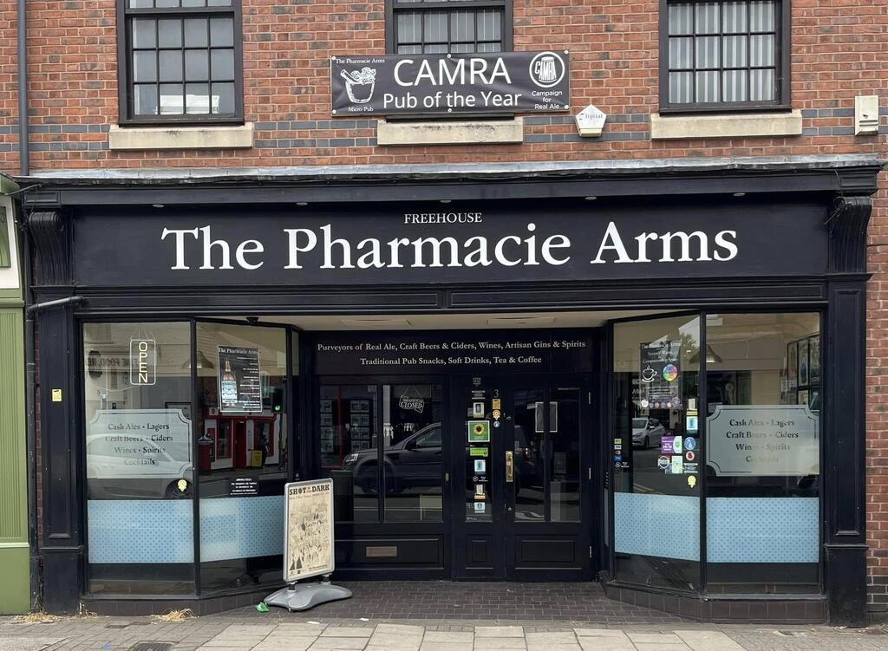
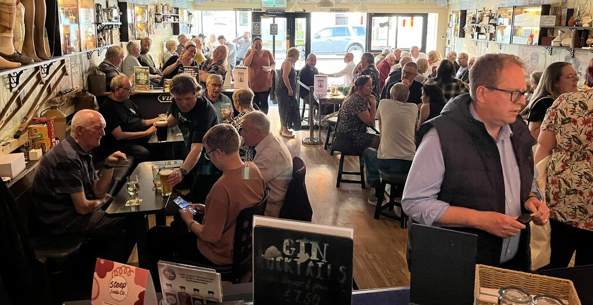
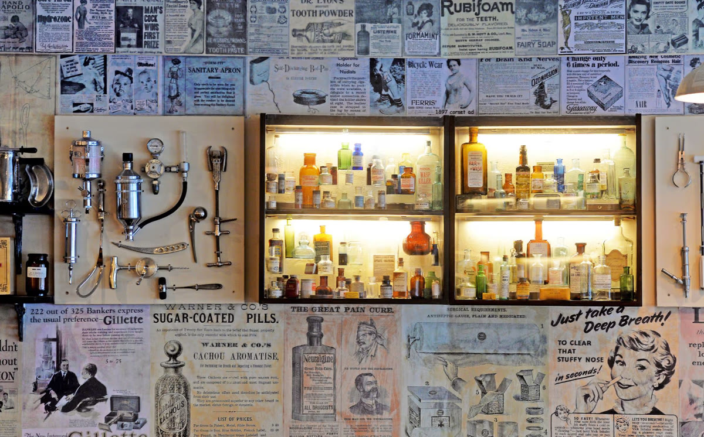

[Latest enclosure fixes, service-lane detail and player-height fly-through](docs/ENCLOSURE_DETAIL_V33.md).

Latest Blender checkpoint: `assets/blender/pharmacie-enclosure-detail-v33.blend`.
Closes ground/upstairs seams and diagonal ceiling escapes; enclosed service lane,
rear threshold details and readable closure signs. V32 street, v30 rear loop and
approved pub/Taraj placement retained. Blender-only; engine package unchanged.
Saved route and visibility rays are not BO3 collision, navigation or co-op tests.
Older latest/checkpoint statements below are historical.

[Latest street vehicles, furniture, opposite shopfront detail and videos](docs/STREET_FRONTAGES_V32.md).

Latest Blender checkpoint: `assets/blender/pharmacie-street-frontages-v32.blend`.
V31 vehicles and bounded street, V32 frontage relief/furniture/crossing approaches;
v30 enclosed rear alley and prior pub/Taraj work retained. Zombies first,
possible PvP later. Engine unchanged; Blender route checks are not game tests.
Sam explicitly requested pushing the completed mapping/media pass on 2026-10-04,
superseding the earlier no-push instruction. Skeleton work is deferred.

[Latest enclosed rear-alley mapping, before/after previews and highlight video](docs/REAR_ALLEY_V30.md). Current Blender source: `assets/blender/pharmacie-zombies-alley-v30.blend`; v29 street/Taraj work retained. New geometry is Blender-only; engine deployment remains unchanged.

[Latest street detail and recovery notes](docs/SYSTON_DETAIL_V29.md). Current Blender source: `assets/blender/pharmacie-syston-detail-v29.blend`. Street materials/lining, individual shop details and new satellite reference; further work toward Pharmacie-level detail is recorded. Blender-only.

[Taraj interior, bridge and ten new renders](docs/TARAJ_BRIDGE_V26.md) · [Syston street base](docs/SYSTON_V25.md).

Latest complete Blender checkpoint: `assets/blender/pharmacie-taraj-interior-bridge-v26.blend`. Taraj now has a detailed restaurant/bar, booths, table settings, timber ceiling and practical lights. Bridge/brook terrain and side access are improved; prior pub/street work is retained. New geometry is Blender-only; engine deployment remains unchanged.

# The Pharmacie Arms: BO3 Zombies Map

A Call of Duty: Black Ops III custom Zombies map inspired by The Pharmacie Arms in Syston, Leicestershire. The first milestone is a small cooperative playable blockout; the Noseley-inspired boss and detailed pub dressing come later.

## Current status

[Firefox Street View reference collector](research/streetview-pipeline/FIREFOX_CAPTURE.md): local screenshots, camera coordinates, searchable labelling gallery and geographic route export. Collection is separate from the Blender scene.

**[Browse the Blender render gallery](docs/BLENDER_RENDER_GALLERY.md)** ·
**[Latest handover and resume steps](docs/HANDOVER_2026-10-03.md)**

Latest engine work: `zm_pharmacie_playtest` loads and plays; Sam confirms doors
work and the sharper window/signage pass looks good. The next build separates
bar drawer/shelf/TV textures and adds a1250-point street-wall purchase toward
Post Office/Natural Wellbeing. It compiled, lit and linked successfully but is
**not yet deployed**. Close BO3 before deploying; full AI/co-op checks remain.
The gallery links the newest v25 street renders and historical v18 interior views.
Older prototype status below is historical where superseded by the handover.

- Latest editable map: [pharmacie-shopfronts-v19.blend](assets/blender/pharmacie-shopfronts-v19.blend). Open with `scripts/open-blender.ps1`. [Six new renders and modelling notes](docs/SHOPFRONTS_V19.md) show real neighbour-shop recesses, frames, bays and grille, with upstairs windows copied at the pub's scale. V18 player cleanup is retained; v19 has not been converted to BO3.
- [Player recon report](recon/v18/README.md):72 before/after player-height screenshots, measured route/geometry checks and remaining work. [Offline comparison gallery](recon/v18/index.html), [main room](recon/v18/after/04_main_room_to_bar.png), [stairs](recon/v18/after/12_stairs_start.png), [upstairs](recon/v18/after/17_upstairs_seating.png). The map is still an estimated blockout; Blender checks are not game collision/playtesting.
- [Proposed Zombies progression](docs/ZOMBIES_PROGRESSION_V18.md): start in the main pub, buy access to street or upstairs, and open a rear alley loop. Three proposed zones/21 named Blender anchors reserve doors, starts, items and zombie entrances. They are planning markers, not working game entities.
- [Detailed street](docs/STREET_PHOTO_RECONSTRUCTION.md) and [interior](docs/PUB_PHOTO_RECONSTRUCTION.md) text references describe44 preserved photos. [v17 street implementation](docs/STREET_REBUILD_V17.md) records isolated facade derivatives and placement estimates. [Blender workflow](docs/BLENDER_WORKFLOW.md) covers the tool setup and older milestones.
- Finish/review Blender before the next Radiant conversion. The separate zombie-free engine scale test remains `zm_pharmacie_scale` from v16; [conversion/results](docs/SCALE_TEST_V15.md). The storefront engine UV fault, actual traversal and co-op still require verification. Older playable source/build statements below describe earlier prototypes.

- The project uses the official BO3 Mod Tools and the Zombies template named `zm_pharmacie`.
- A code-authored first-pass blockout is in `map_source/zm/zm_pharmacie.map`, with its preserved BO3-generated template, repeatable generator, and GSC/CSC/zone source files in this repository.
- The first geometry version compiled and linked successfully with BO3 Mod Tools on Sam's PC. The current layout iteration follows Sam's Paint sketch; rebuild results for that iteration are recorded in `MODLOG.md`.
- The saved SVG layout now compiles, lights, links, and plays in BO3. The first local session reached **2 rounds survived and 6 kills** on 2026-10-02. Full route coverage and co-op still need verification. Compiled outputs are local and not tracked here.
- Latest source adds L-shaped stairs to an empty upstairs room, photo frontage with a real doorway, photo bar and pharmacy walls, a transparent skeleton/chair, and eight tables with sixteen chairs. The photo build compiled and loaded; [frontage screenshot](docs/screenshots/photo-frontage-first-game.png) confirms the front texture. Lighting/exposure is currently poor; stairs, other panels and co-op need individual runtime checks.
- The reference photos are preserved under `references/pharmacie-syston/`. Do not overwrite them or distribute them in a released map without checking rights.

## Continue on another computer

1. Install Call of Duty: Black Ops III and the official **Call of Duty: Black Ops III - Mod Tools** through Steam (tool app 455130).
2. Find the Steam library paths on that computer; paths recorded elsewhere in these notes are specific to Sam's PC.
3. Clone/pull this repository. The map, TIFF inputs, custom GDT, photo references and skeleton derivative are included. You can build these directly; to regenerate, install Python 3.11+ and `python -m pip install -r requirements.txt`, then run `python scripts/prepare_photo_assets.py` followed by `python scripts/generate_blockout.py`.
4. From the repo root in PowerShell, run `./scripts/build-map.ps1 -ToolsRoot '<your Steam library>\steamapps\common\Call of Duty Black Ops III 455130'`. Use the actual folder containing `bin/Radiant_modtools.exe`; some installations may use a different folder name. The script stages the map, complete Zombies project source, TIFFs and GDT into the tools workspace, registers the assets, then compiles, lights and links. It does not deploy to the retail game. See [photo material workflow](docs/PHOTO_MATERIAL_WORKFLOW.md) for the asset database repair if needed.
5. Inspect the layout in Radiant. For testing, close BO3, back up any existing `usermaps/zm_pharmacie` package in the retail game, and copy the built `zone` folder from the tools' `usermaps/zm_pharmacie` into the game's `usermaps/zm_pharmacie`. Then launch the game executable from its game directory with `+set fs_game zm_pharmacie +set logfile 2 +devmap zm_pharmacie` for a solo test. Ask your machine's owner before an agent writes into the game installation or takes over input. Do not change desktop resolution.
6. Record exact build/test steps and results in `MODLOG.md`; generated outputs and absolute paths are machine-specific.

Keep work offline/private. Do not edit stock tool maps or game files. Read `AGENTS.md` and `MODLOG.md` first. Brownie's next priority is lighting/exposure/probes (dark photo panels and white weapon/sky), followed by testing the L-shaped stairs and zombie pursuit upstairs. The original photos remain unchanged; distribution rights remain unresolved.

## Project notes

- [Mod log and next action](MODLOG.md)
- [Detailed Zombies design](docs/ZOMBIES_DESIGN_V29.md) and [Radiant gameplay placement plan](docs/RADIANT_GAMEPLAY_PLACEMENT_PLAN.md)
- [Radiant conversion playbook](docs/RADIANT_CONVERSION_PLAYBOOK.md) and [installed-stock mechanics audit](docs/RADIANT_STOCK_GAMEPLAY_AUDIT.md)
- [Offline BO3 tutorial library](research/radiant/README.md): licensed source snapshots, readable text, hashes and author-linked notes
- [Player recon and screenshot evidence](recon/v18/README.md)
- [Zombies door/zone/item progression proposal](docs/ZOMBIES_PROGRESSION_V18.md)
- [Photo-to-text street reconstruction](docs/STREET_PHOTO_RECONSTRUCTION.md)
- [Photo-to-text pub reconstruction](docs/PUB_PHOTO_RECONSTRUCTION.md)
- [BO3 setup and handoff plan](MODDING_PLAN.md)
- [Radiant workflow and automation findings](docs/RADIANT_WORKFLOW.md)
- [Blockout layout and clean plan](docs/BLOCKOUT_LAYOUT.md)
- [Editable SVG floor plan](docs/pharmacie-layout-v1.svg)
- [Sam's saved layout](references/pharmacie-syston/pharmacie-layout.svg) and [SVG-to-map implementation notes](docs/SVG_BLOCKOUT.md)
- [Interactive layout editor](docs/layout-editor.html) (open in a browser to drag and label items)
- [Photo-based layout observations](docs/THE_PHARMACIE_MAP_NOTES.md)
- [Photo gallery with previews and descriptions](docs/PHOTO_GALLERY.md)
- [Photo-to-game-asset plan](docs/PHOTO_ASSET_PLAN.md)
- [Latest photo materials, reproduction steps and build gotchas](docs/PHOTO_MATERIAL_WORKFLOW.md)
- [Successful photo-build log](docs/build-results/photo-pass-verified-build.log)
- [Photo sources and provenance](references/pharmacie-syston/README.md)

## Photo previews

The [numbered Syston street catalogue](docs/street-catalogue/index.html) has 68
small building/feature dossiers and a searchable map. Start with its
[reading guide](docs/street-catalogue/README.md); original Street View captures
stay local and are linked from each dossier.

These reference photos guide the exterior, room layout, bar, and pharmacy feature wall. Select a preview to open the full image; see the [photo gallery](docs/PHOTO_GALLERY.md) for all collected references and descriptions.

| Street frontage | Main room | Bar front | Pharmacy feature wall |
|---|---|---|---|
|  |  |  |  |

## Goal for the first playable version

Build the main pub room with player spawns, zombie routes, round logic, and enough space to move and fight. Verify those basics before expanding into side rooms, custom textures, detailed props, or the boss encounter.

## Credits and source scope

Built with Codex assistance and official BO3 Mod Tools. The transparent skeleton/chair derivative was isolated with OpenAI image generation; other photo derivatives use deterministic format conversion and UV crops. Sources and provenance are recorded in the reference README and `assets/photos/manifest.json`.

This is an in-progress source handover, not a packaged Workshop release. Local profiles/backups, asset databases/caches, and compiled game packages remain ignored under `build/` or in the installations; rebuild those on your own machine. The repository includes project source, reference/derived art, screenshots and selected text build evidence.
[Latest opened road to Taraj and high-quality tour](docs/TARAJ_ROAD_V34.md).
Current Blender checkpoint: `assets/blender/pharmacie-taraj-road-v34.blend`.
The west closure is archived and the Melton branch has connected frontage
approaches, backed terrain and deliberate outer boundaries. Blender-only;
engine/gameplay verification remains separate.
