# 3D shopfront Blender renders

Eight shopfronts now have modelled frames, projecting signs, recessed closed
doors and upper windows. Upstairs window dimensions match the pub at Sam's
request. Shop interiors are not modelled; selected display photos remain inside
the new frames. Main lettering is geometry with approximate typefaces.

Latest complete source: [v21 Blender map](../assets/blender/pharmacie-shopfronts-fridge-v21.blend).
These are Blender previews with temporary review lighting. The new fronts have
not been exported or verified in Radiant/BO3. Original reference photos are unchanged.

## Beside the Pharmacie Arms

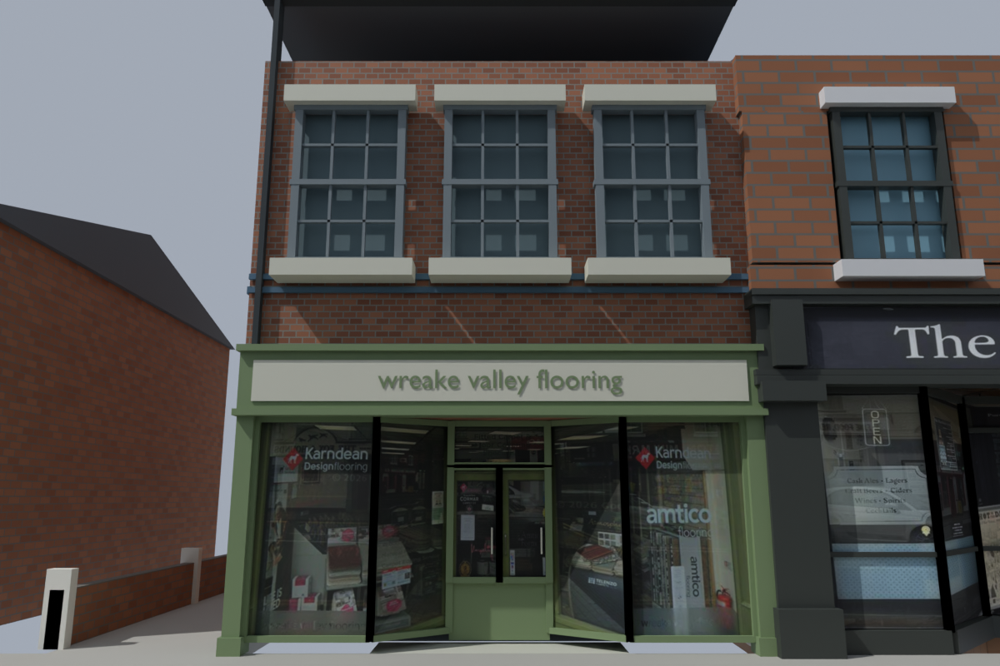

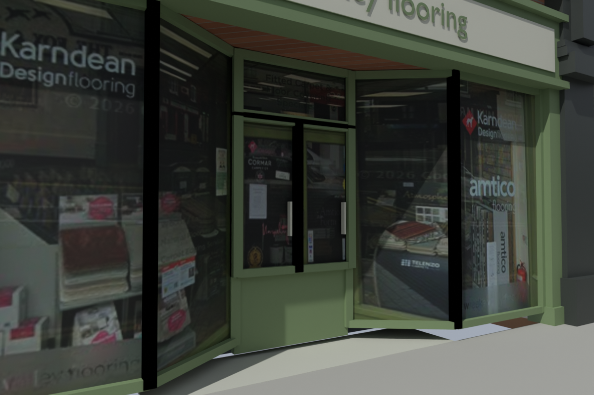

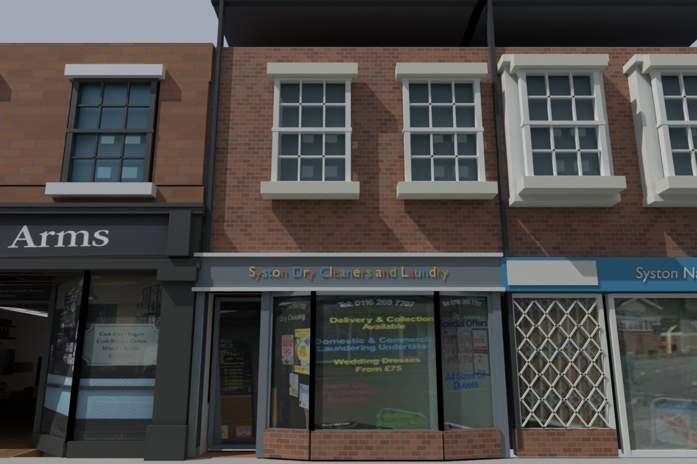

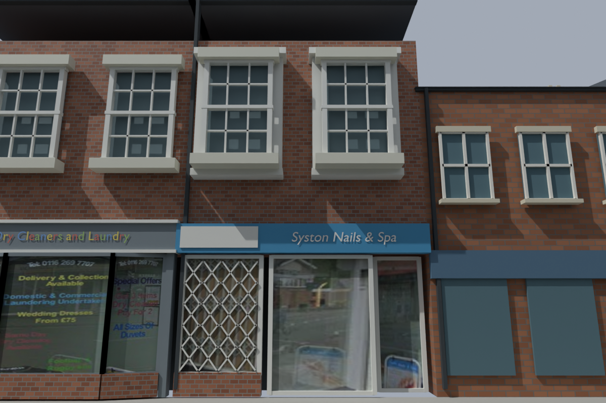

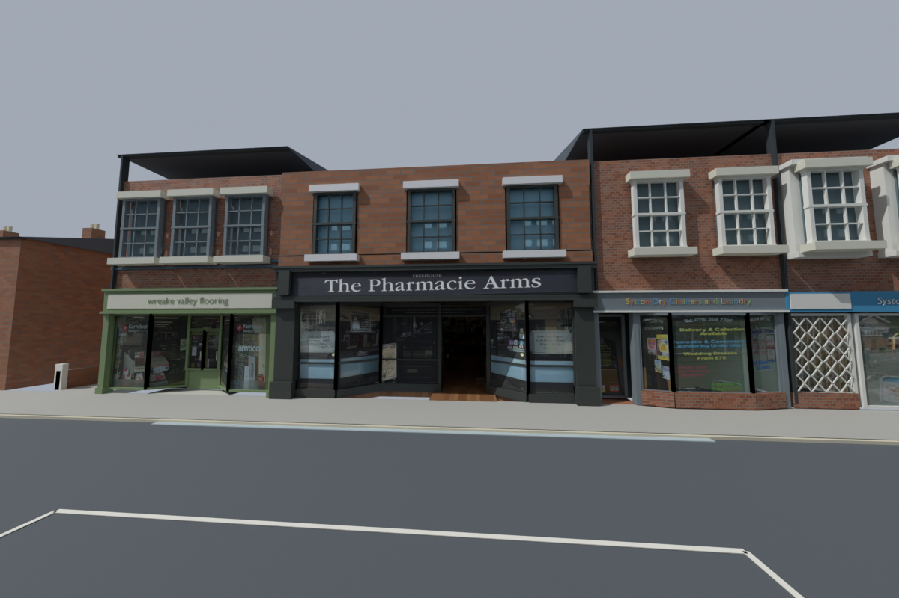

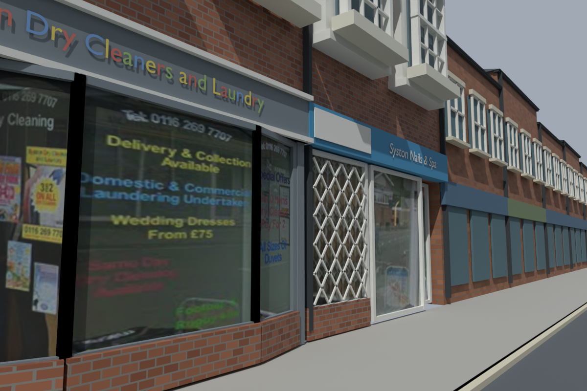

## Opposite the pub

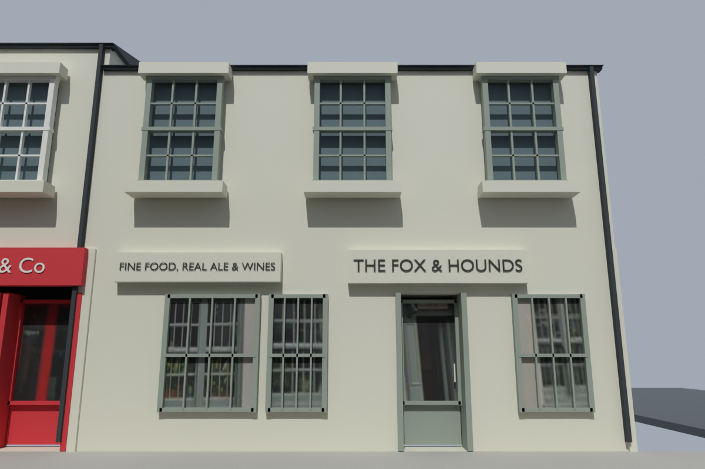

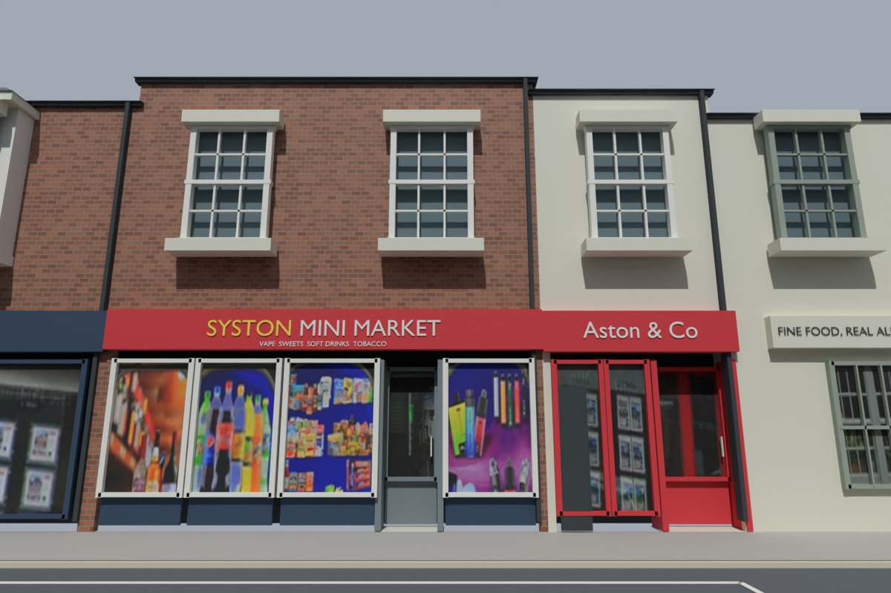

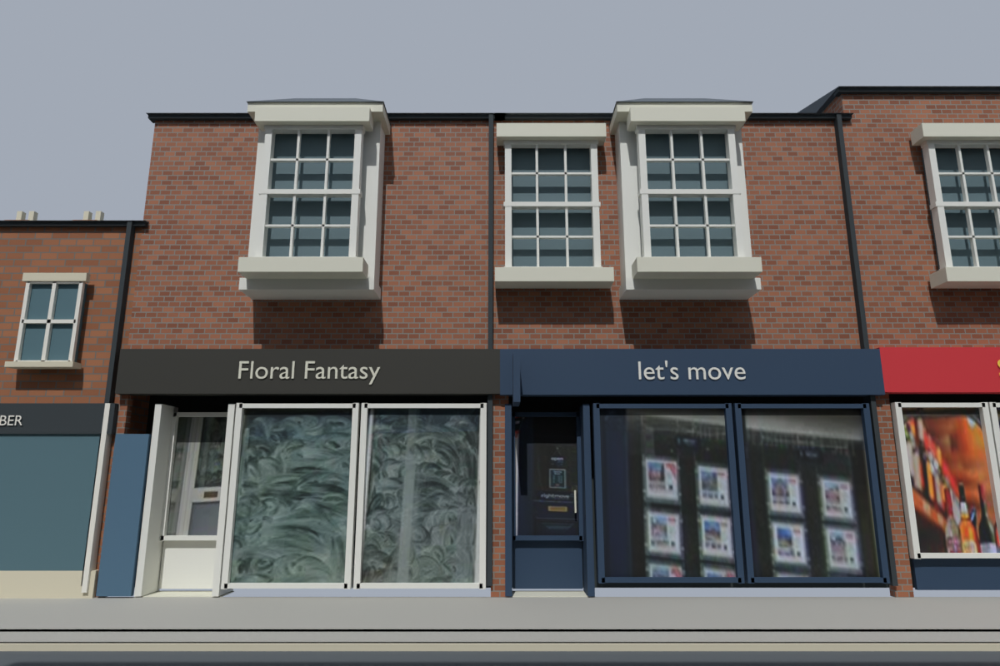

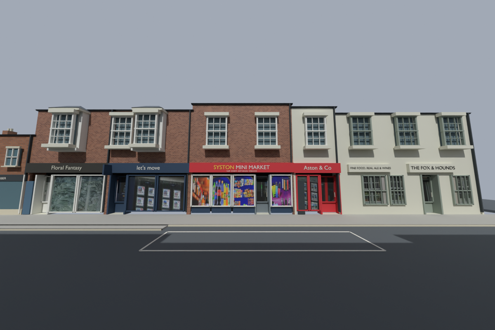

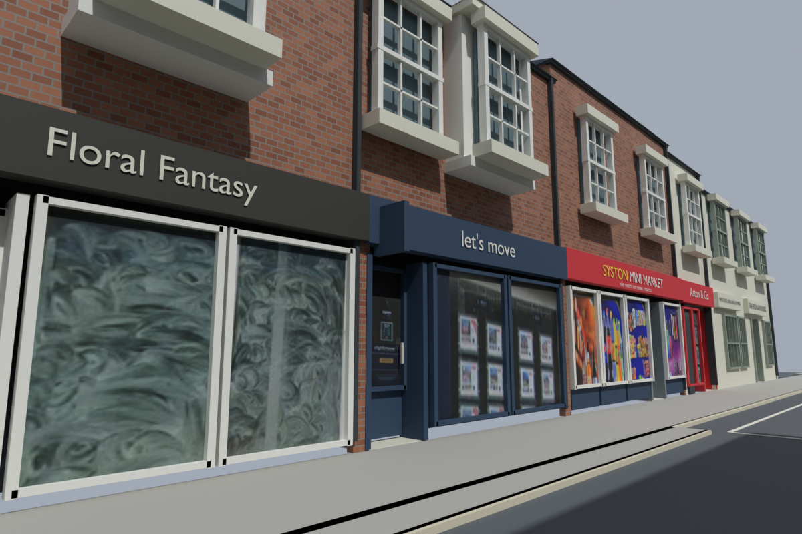

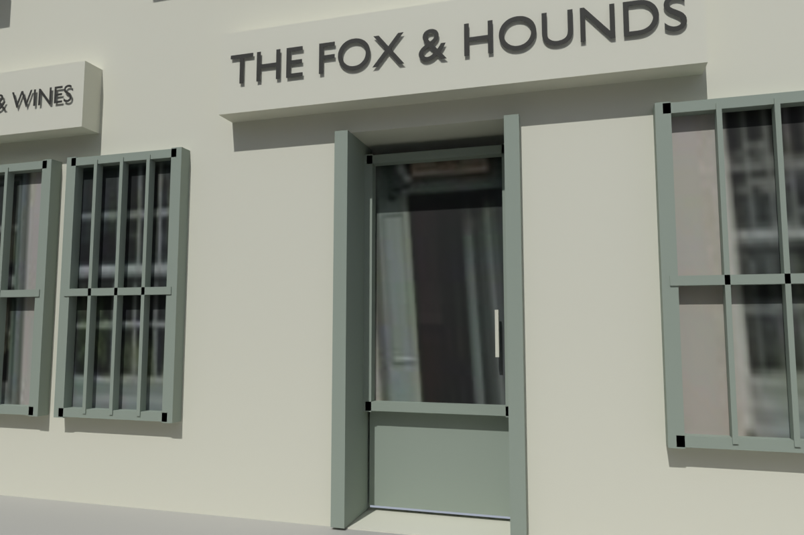

## Bar fridge placement

The complete fridge assembly has moved towards the left bar end and forward
0.28 m, leaving 5 mm clearance from the timber's outermost edge. Placement is
estimated from the Facebook walkthrough at 61 seconds and Sam's instruction.
Appliance dimensions and all 16 parts are preserved.

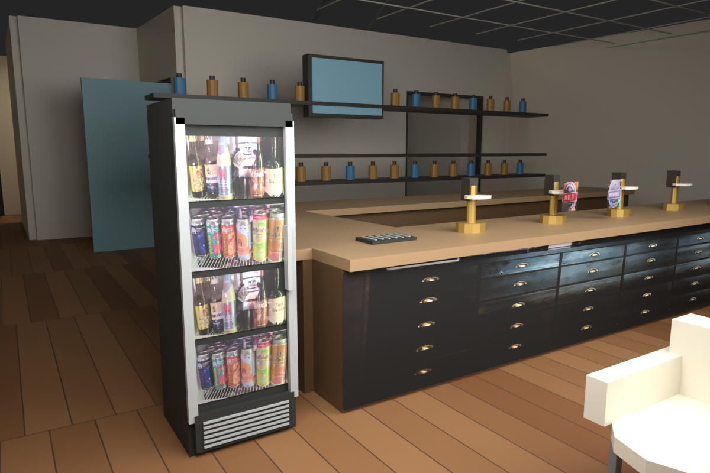

[Neighbour modelling notes](SHOPFRONTS_V19.md) ·
[Opposite modelling notes](SHOPFRONTS_V20.md) ·
[Fridge validation](../recon/v21/validation.json) ·
[Earlier pub gallery](BLENDER_RENDER_GALLERY.md)
