# Blender render gallery

Player-height views of The Pharmacie Arms map: frontage, main room, bar,
stairs, upstairs and surrounding street. Select any image to open it full size.

These are the saved **v18 Blender inspection renders**, made with Cycles at
1100×700, a22mm lens and a1.65m eye height. Temporary inspection lighting helps
show the geometry. They precede the latest engine-only signage/bar assets and
buyable crossing wall; they are not screenshots of the current BO3 build.

[Latest work and resume notes](HANDOVER_2026-10-03.md) ·
[All36 final views](../recon/v18/SCREENSHOTS.md) ·
[Before/after gallery](../recon/v18/index.html) ·
[Blender source](../assets/blender/pharmacie-player-cleanup-v18.blend)

## Entrance and main room

The recessed entrance opens onto the pub's long central aisle.

[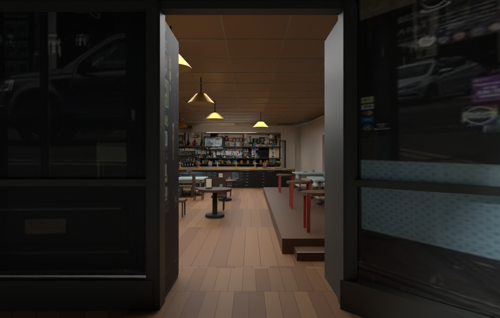](../recon/v18/after/01_street_to_pub.png)

[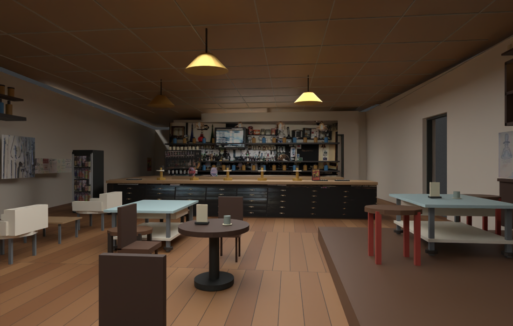](../recon/v18/after/04_main_room_to_bar.png)

## Pharmacy wall and raised seating

Photo-backed display cases and adverts sit beside the playable aisle. The raised
right-hand seating area has an intermediate entry step.

[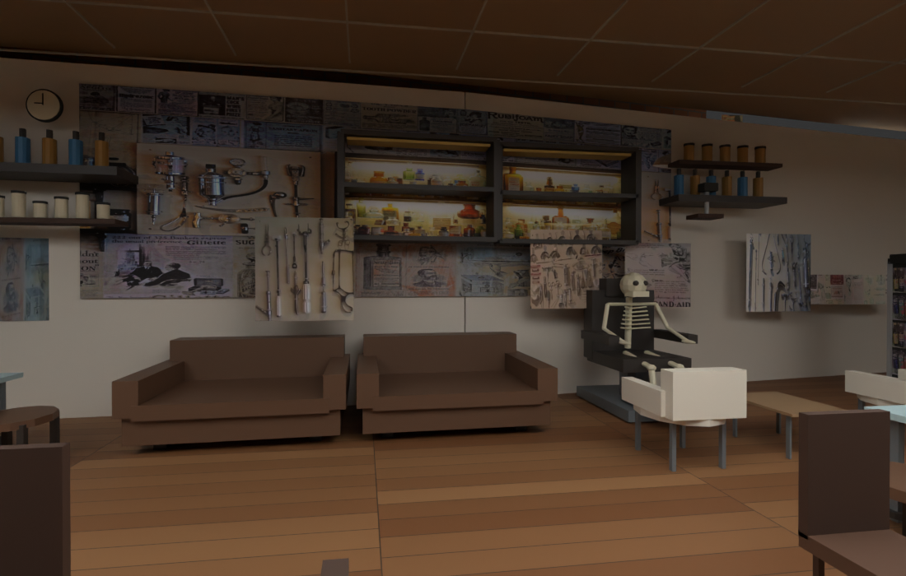](../recon/v18/after/05_left_display_wall.png)

[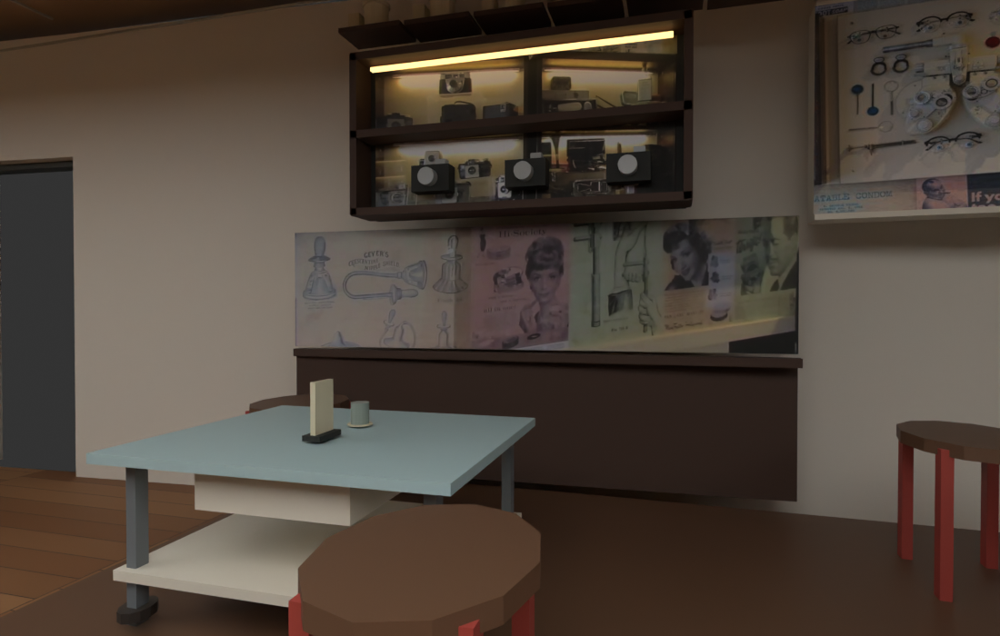](../recon/v18/after/06_right_platform.png)

## Bar

The counter, pumps and backbar combine geometry with distinct photographic
regions. The latest engine pass separates drawer fronts, upper shelves and TV
into independent assets to correct the game mapping.

[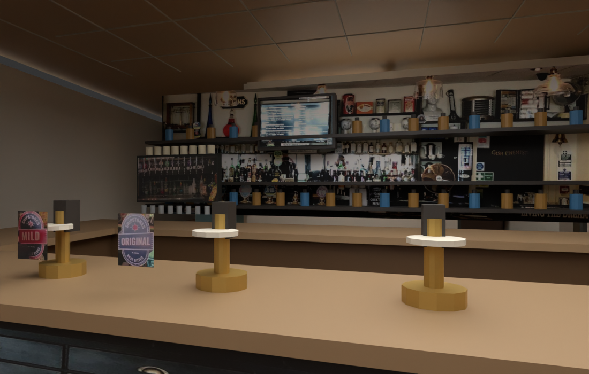](../recon/v18/after/08_bar_front.png)

## Stairs and upstairs

The L-shaped stairs lead to upstairs rooms. Smaller tread rises, warm stair
lights, ceiling closure and a wider arrival were part of the v18 cleanup.

[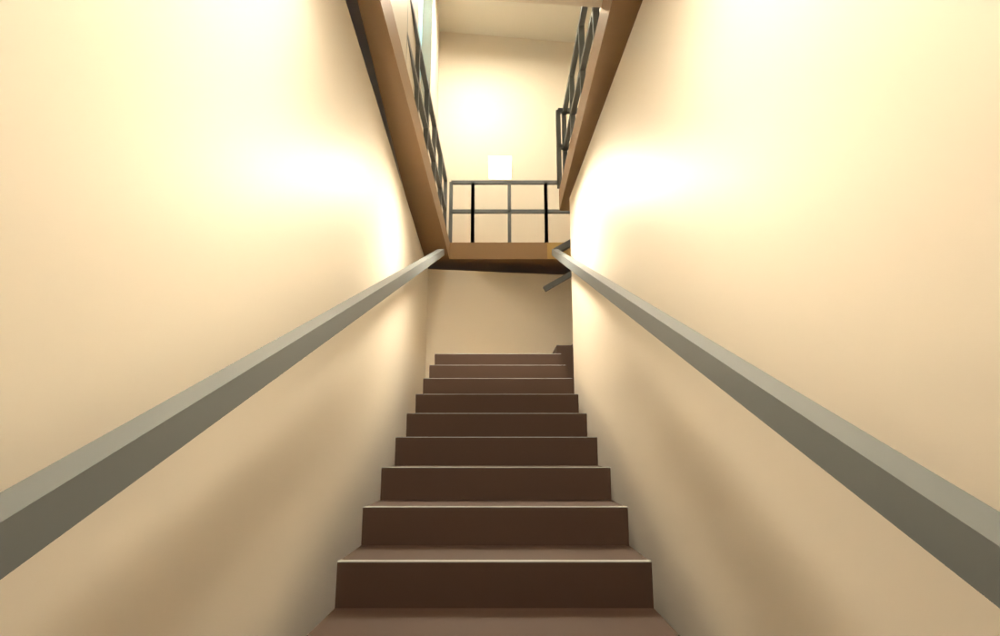](../recon/v18/after/12_stairs_start.png)

[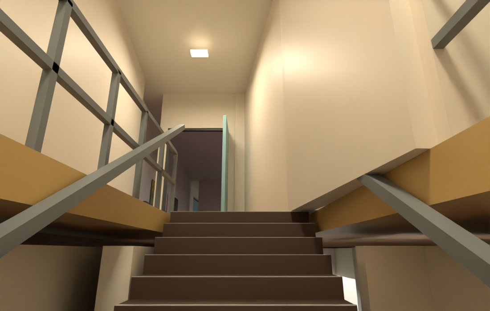](../recon/v18/after/14_stairs_turn.png)

[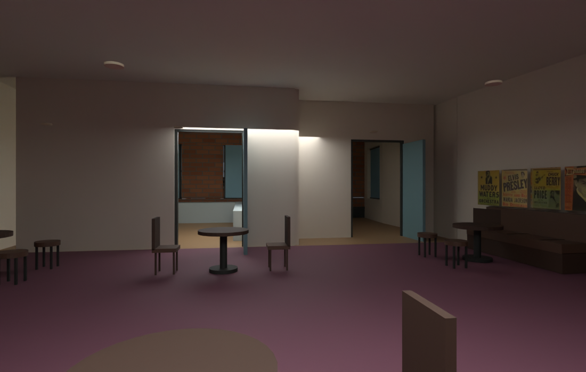](../recon/v18/after/17_upstairs_seating.png)

## Street, alley and crossing

The alley sits beyond the flooring shop on the pub's left. The fuller opposite
row, crossing and Natural Wellbeing lane provide the next expansion area.

[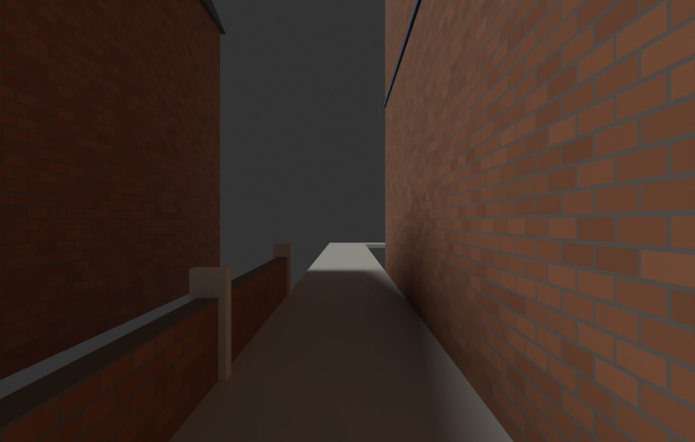](../recon/v18/after/20_alley_entrance.png)

[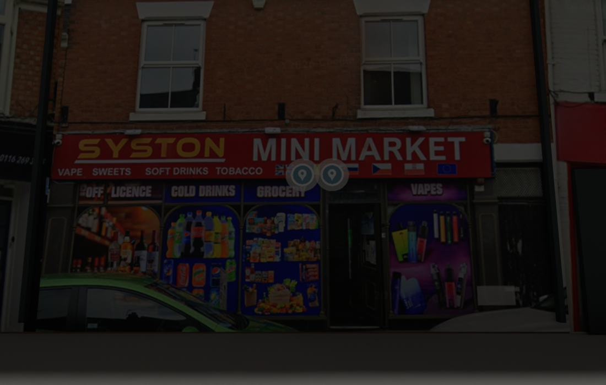](../recon/v18/after/24_opposite_row.png)

[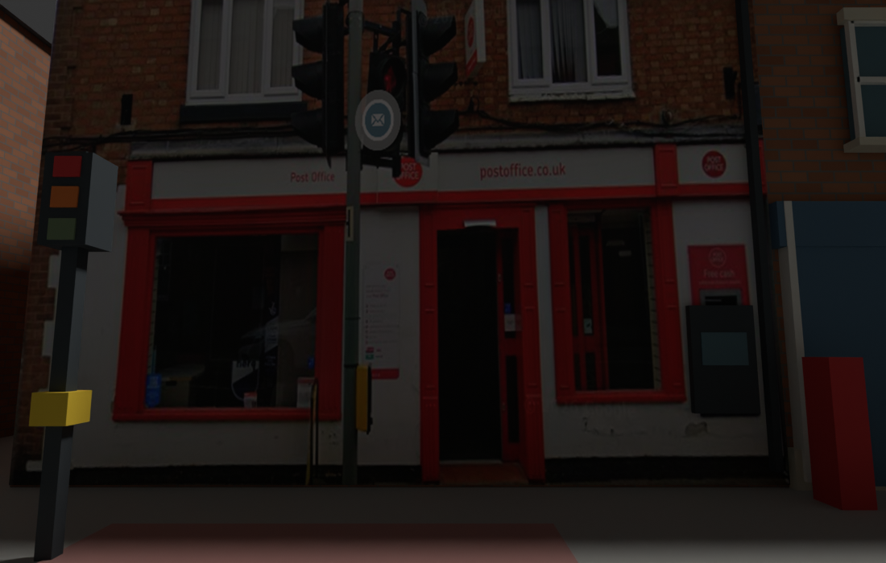](../recon/v18/after/25_crossing.png)

[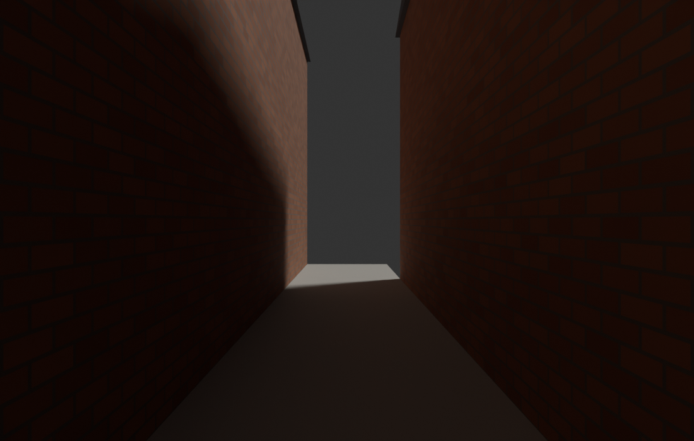](../recon/v18/after/26_wellbeing_lane.png)

Dimensions and placement remain photo-led estimates with gameplay adaptations.
See the [recon report](../recon/v18/README.md) for coverage and limitations.
