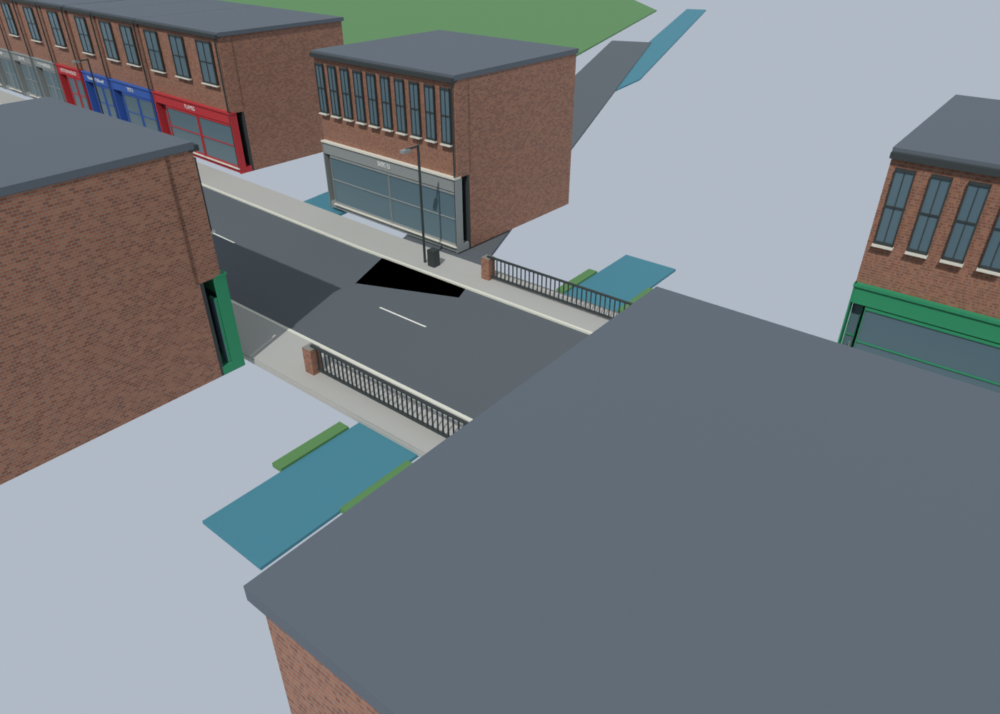
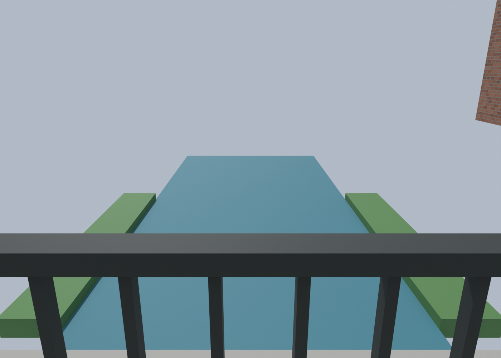
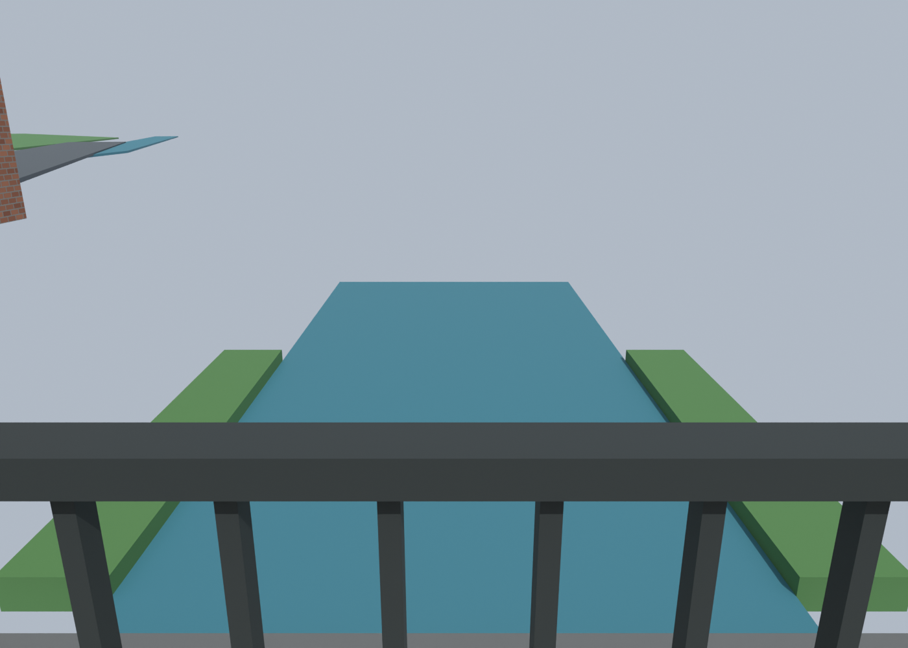
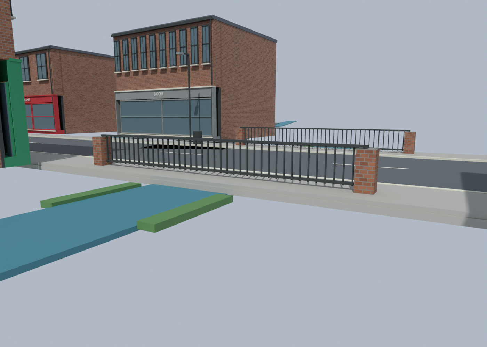
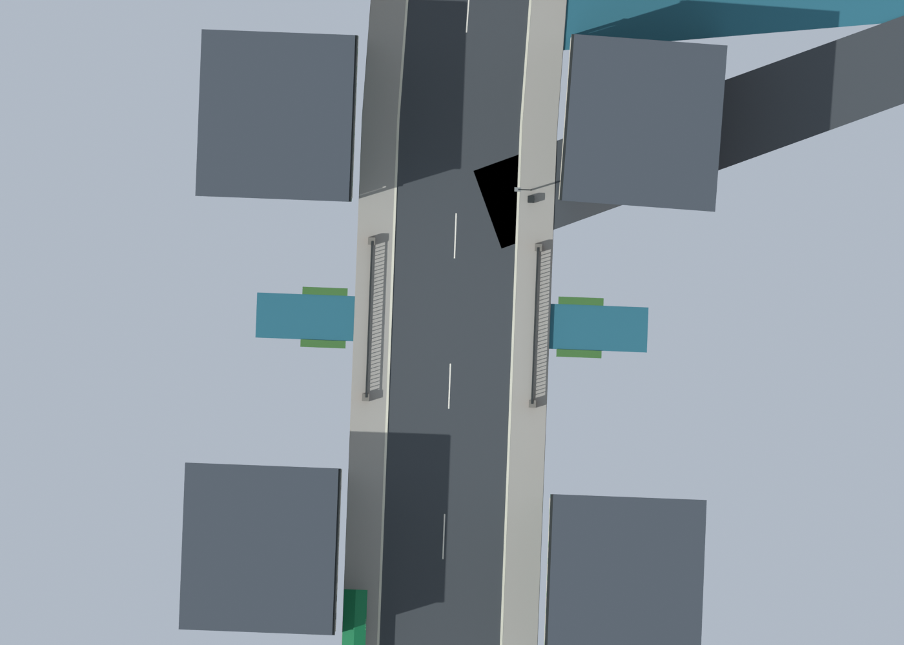

# Bridge and brook — close-up Blender review

Five new inspection renders of the saved v25 scene, compared with the original
F003/F004 Street View references. The scene was inspected without editing or
saving its geometry. Temporary daylight and inspection cameras were not saved.

## What the review found

- The current bridge is still a blockout: road/pavement ribbon, dark straight-bar
  railings, brick end piers, a short rectangular water strip and four green bank
  strips. It does not yet resemble the complete photographed brook setting.
- The water is only about0.20m below the carriageway. There is no modelled deep
  channel, substantial bank terrain, abutment/underside structure or vegetation.
  Actual channel depth/underside construction remain unknown from the photos.
- The local water stops abruptly on both sides and is disconnected from the older
  schematic brook course. Four downward samples confirm it is visible outside
  the bridge; the problem is missing surroundings/depth, rather than hidden water.
- Reference075 shows grey railings, a low pale base strip, trees/banks, brick side
  walls and a longer watercourse. Reference077 shows water with sloped vegetation,
  adjacent car parking, pale metal fences and decorative green street columns.
  These details are not yet represented by the simple current scenery.
- The retained Brookside/access road passes through B014 Banking Hub's rear
  scenery mass. Two of seven sampled centreline positions hit that mass overhead.
  Earlier390 clearance checks were on Melton Road, not this side branch.
- A black triangular patch appears where the side branch joins the main road.
  The road meshes have coincident surface heights; overlapping surfaces are the
  suspected cause, not yet isolated by a geometry repair.

The next geometry pass should connect/deepen the brook, form continuous banks and
bridge supports, restore the photographed railing/base treatment, add the visible
landscape/parking context, and resolve the branch/building and road overlaps.
Keep exact depths, access naming and surveyed dimensions explicitly estimated.

## Overview

## Player height — looking over each railing

## Side structure

## Bridge and access plan

[Bridge photo dossier F003](street-catalogue/entries/F003.html) ·
[Access photo dossier F004](street-catalogue/entries/F004.html) ·
[Inspection measurements](../recon/bridge-v25/inspection.json) ·
[Access checks](../recon/bridge-v25/access-check.json)

Reproduce: Blender5.2 `--background assets/blender/pharmacie-syston-street-v25.blend
--python scripts/render_bridge_review.py`. Log: ignored build/bridge-v25-review.log.
Five1400×1000 Cycles renders,16 samples. Source SHA256 checked unchanged before
and after rendering. These are Blender observations, not a Radiant/BO3 test.
