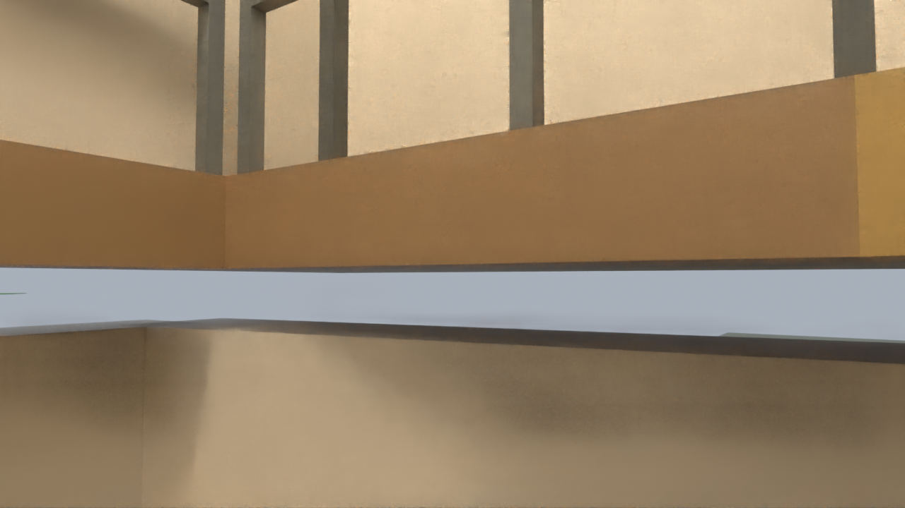
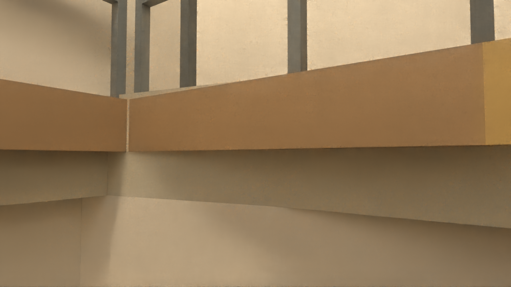
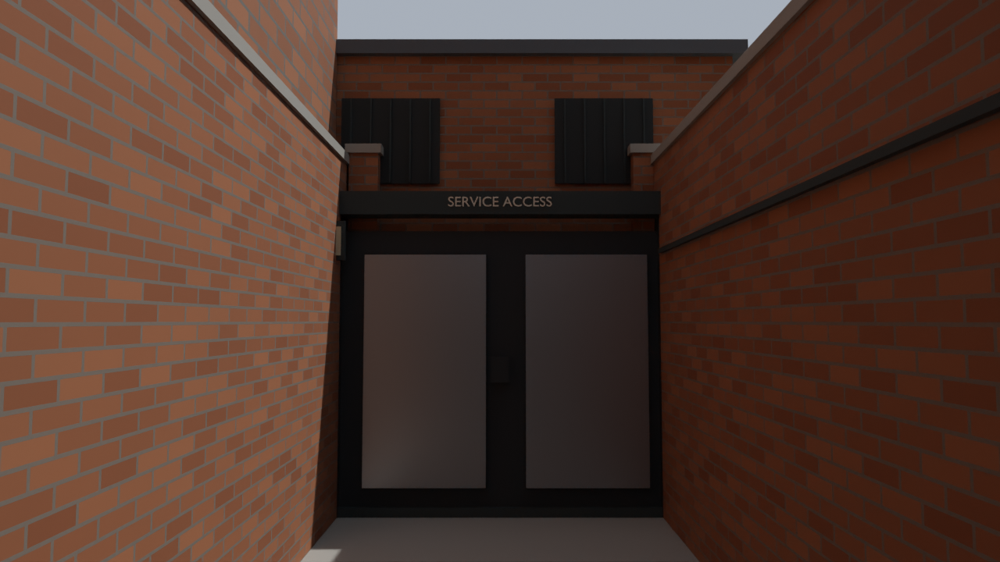

# Enclosure and service detail — v33

Checkpoint: `assets/blender/pharmacie-enclosure-detail-v33.blend`.
[Player-height fly-through and matched review gallery](../recon/v33/index.html).
Built from the complete v32 checkpoint; approved pub, neighbours, Taraj,
vehicle placement and v30 rear loop are retained. This is Blender mapping;
the deployed BO3 package is unchanged.

## What the inspection found and fixed

Ground-floor outside walls stopped at roughly 4.35m while upstairs walls began
at 4.8m. Slightly different skewed footprints and the rear/stair floor opening
left views into the background between them. A player-height stair preview
shows the exposed horizontal sky strip particularly clearly.

New full-thickness wall bands overlap the existing wall/floor edges. A solid
ceiling follows the ground-floor footprint with the L-shaped stair void kept
open. Its closed polygon sections cover the exposed perimeter without lowering
the stair clearance. A continuous upper rear wall backs the store/stair hall.
These are repairs to measured geometry in this gameplay-scaled model, not
changes to the source photographs or surveyed architectural claims.

The Natural Wellbeing service lane had a gate at its end but incomplete side
enclosure/background. It now has continuous brick side boundaries with coping,
a closed maintenance-building backdrop, a gate header and bottom closure,
high protected windows, wall-side conduit/cabinet, drainage and a readable
service notice. Outdoor sky above the passage is intentional. The new yard is
inferred gameplay scenery; the real lane's hidden rear architecture is unknown.

Rear-exit reveals, head drip, shallow lamp and flush threshold drainage finish
the escape-loop transition. Inside-facing road-closure plates cover the earlier
reversed lettering, and kick plates close the gaps below both street boundaries.
No new working purchase, barricade or spawn behavior is added by these meshes.

## Saved geometry checks

- 147 new closed meshes pass positive-volume/manifold checks after reopening.
- Existing 572 pub/alley and 1,248 street route samples pass at 0.42m radial
  clearance with floor support and 1.95m overhead checks.
- A separate connected camera route adds 1,418 samples at 0.10m spacing and
  sixteen horizontal ray directions at three body heights. Its main-room to
  rear-corridor connection is traced around existing furniture. The upstairs
  turn moves forward around a guard post detected by the finer sampling.
- 161 interior positions, 32 bearings and six upward inclinations produce
  30,912 rays: 204 unexplained open rays before, zero after. All 73 remaining
  open rays intersect the measured rear-door aperture below its header before
  reaching outdoor sky. Long rays hitting opposite shops are reported separately.
- The parent checkpoint hash, all parent active-scene mesh geometry and all
  44 catalogued original reference hashes remain unchanged.

These are visible-mesh samples, not continuous capsule sweeps, a watertightness
certificate, engine collision or BO3 navigation. The original eight-direction
checks missed the guard-post proximity found by the finer camera check; the
recorded route bends around it rather than claiming the original turn was safe.

Evidence: [changes](../recon/v33/changes.json),
[saved route checks](../recon/v33/validation.json),
[before enclosure survey](../recon/v33/before-enclosure-survey.json),
[after enclosure survey](../recon/v33/after-enclosure-survey.json),
[connected camera route](../recon/v33/flythrough-route.json),
[media/provenance verification](../recon/v33/delivery-validation.json).

## What reads well and what remains

The main pub aisle, retained display/bar architecture, upstairs shell and narrow
v30 rear alley form coherent spaces. The new ceiling/seam repairs close the
visible interior escapes without widening the pub or shifting approved fronts.
The service lane now reads as a deliberate walled dead end.

The wider Fox junction and long Melton/bridge scenery still need accurate
road/pavement/terrain finishing before becoming combat space. Their floor
backing is useful scenery support but does not finish the street reconstruction.
Taraj remains a separate future branch. Existing static rear boards and gates
still need actual stock Zombies entities, zones, collision and runtime checks.
The roughly 1.6m rear-bin section, stair bottleneck and upstairs return should
be tested with player passing, revives and pursuing zombies after conversion.

## Media and reproduction

The 60-second textured flight has three continuous sections, with cuts between:
street → pub → rear corridor → rear alley → street (40s), stairs/upstairs (12s),
and the service lane (8s). 1280×720, twelve distinct rendered frames per second,
encoded for 24fps playback. The short earlier-scene inspection is 12s, eight
distinct renders per second. Both are presentation camera paths, not game footage.
Still previews use matched 12-sample Cycles inspection lighting; highlights
show new walls/details in gold and ceiling backing in green. Temporary lighting,
cameras and highlights are never saved into the checkpoint.

Run Blender 5.2.2 LTS in background with the input checkpoint and these scripts:

1. `build_enclosure_v33.py` creates v33 from v32. It refuses an existing output
   unless explicitly given `V33_REBUILD=1`; preserve any later user edits first.
2. `check_enclosure_v33.py` checks saved solids, retained routes and preservation.
3. `review_enclosure_v33.py` surveys/renders; `V33_PHASE=before|after|highlight`,
   optional `V33_AUDIT_ONLY=1` or comma-separated `V33_VIEWS`.
4. `plan_flythrough_v33.py` traces and checks the connected camera paths.
5. `render_flythrough_v33.py`, `V33_VIDEO_PHASE=after|before`, renders directly
   into FFmpeg through one overwritten scratch PNG. This avoids keeping hundreds
   of full-size frame files on the nearly-full system drive.
6. `python scripts/contact_enclosure_v33.py before` and `after`, then
   `python scripts/gallery_enclosure_v33.py` build/recheck the delivery.

Exact logs: ignored `build/enclosure-v33-*.log`. An initial ceiling Boolean
prototype failed the manifold check before saving; final ceiling pieces use
deterministic clipping/extrusion of the source floor triangles. A first flight
was restarted with four-sample denoising and a four-bounce preview limit;
the stills retain their higher inspection quality. No engine build/deployment
or BO3 controls were used.
