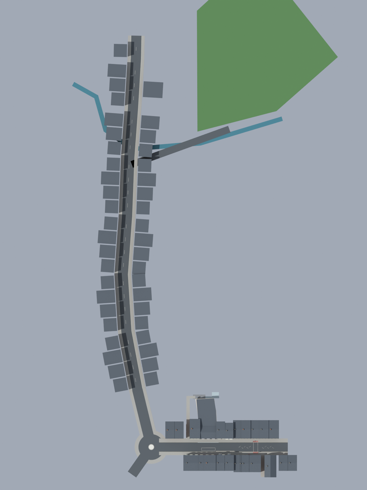
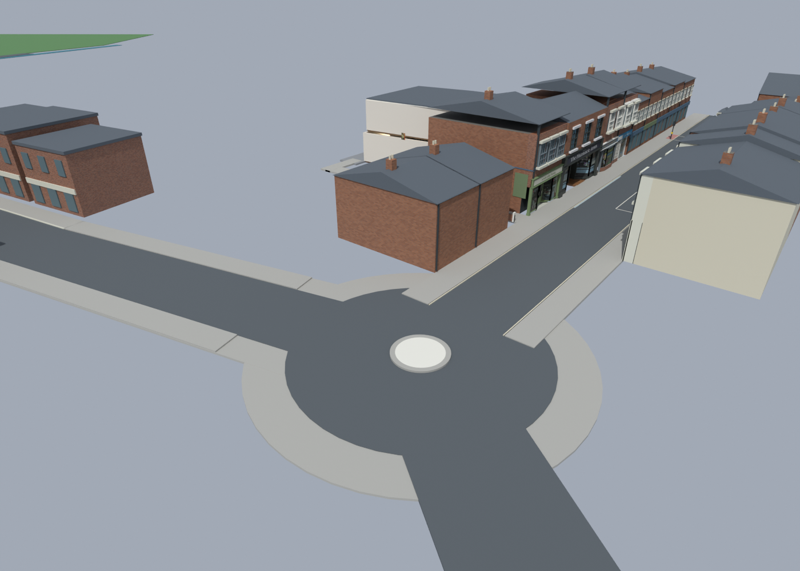
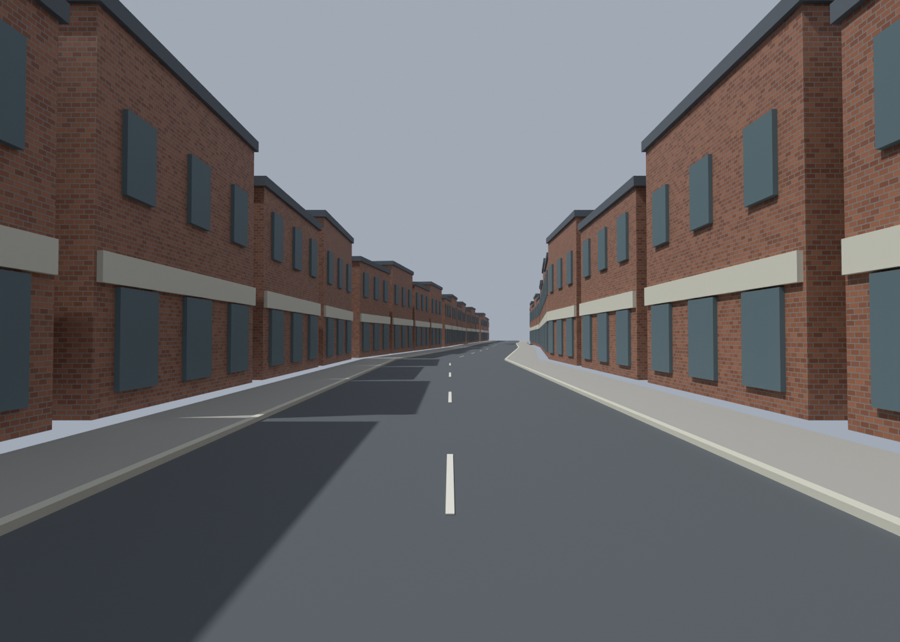
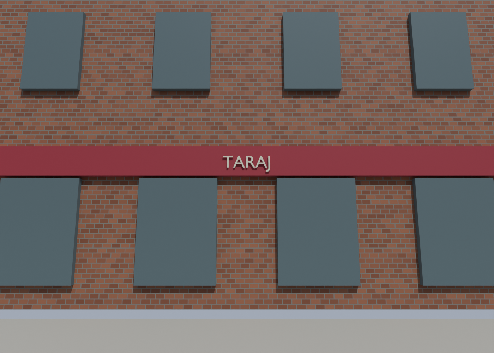

# Melton Road extension and Taraj blockout — v22

[Open the Blender source](../assets/blender/pharmacie-melton-road-v22.blend).
The reviewed pub, eight 3D shopfronts and fridge placement from v21 are retained.
High Street now connects to a roundabout and an estimated Melton Road route
reaching the circled Taraj site. All new work is Blender blockout geometry;
no Radiant export, collision, Zombies pathing or gameplay verification yet.

## What the supplied map establishes

Source: `references/the top view map to build down to taraj - top right is natural wellbeing and opposite down the road is pharmacie -.png`.
The original is preserved without editing; its SHA256 is in
[the geometry manifest](../recon/v22/validation.json).

- Natural Wellbeing is labelled beside the upper High Street segment. Sam
  identifies the Pharmacie on the opposite row farther along that street.
  Its exact footprint is obscured by the white masking in this reference.
- High Street runs diagonally southeast to the visible roundabout at the
  right edge. Roads beyond the clipped right edge cannot be reconstructed here.
- Melton Road leaves the roundabout towards the lower left, with a gradual
  change in direction rather than a single straight corridor.
- B&M, bistrooggi and Costa are labelled near its northern section. These
  labels establish neighbourhood context, not exact building dimensions.
- Brookside branches from the west side farther down. A blue brook crosses
  near this section and bends along the park/road area.
- The kids park is southwest of Brookside; the telephone exchange and public
  toilets are labelled across Melton Road. Their detailed footprints/heights
  are not established and have not been given invented detailed models.
- Taraj is explicitly circled on the east/right side of lower Melton Road,
  beyond Brookside. A solid, non-enterable placeholder marks this parcel.
  Its fascia, window arrangement and colours await Sam's shopfront photo.

## Scale and modelling decisions

The raster has no scale bar or reliable surveyed distances. The similarity
transform aligns its High Street direction with existing Blender X and places
the Natural Wellbeing road projection at `(52.5, -6.7)` and roundabout centre
at `(-40, -6.7)`. Pixel anchors are `(885,215)` and `(1065,352)` respectively.
This is approximately **0.409 m per raster pixel**, calibrated to the enlarged
existing gameplay scene. It is an estimate, not real-world 1:1 survey accuracy.

Melton Road uses an **8 m carriageway** and roughly **2.45 m pavements** on
each side. The roundabout has a 10 m carriageway outer radius and a low 2.3 m
central island. Its exact design and the clipped continuation are unresolved;
the short far arm is labelled unsurveyed. Brookside is a 5.5 m branch.
Taraj's provisional mass is 12 m wide, 15 m deep and 8.5 m tall. Other masses
are anonymous scenery estimates with simple windows and roofs.

Road and pavement bends are closed mitred ribbons. The old Fox junction stub
and island are preserved in an unlinked archive. Render review moved the new
approach pavement starts outside the circular carriageway. Original pub and
shop geometry is checked for identical vertices and faces during generation.
Temporary review daylight is not saved into the map.

## Render review

## Next modelling and gameplay steps

Use the Taraj frontage photo to replace its provisional sign/windows with
recognizable 3D relief, keeping the road-side parcel position adjustable.
More junction evidence would resolve the clipped arms and island design.
Avoid opening this whole road as an undivided Zombies area: purchases, zones,
zombie entry points, return routes and useful destinations require a separate
gameplay pass before conversion. The street extension itself adds no functional
doors, enemies, weapons or round scripting.

Reproduction: background Blender v21 with `scripts/extend_melton_road_v22.py`.
`scripts/review_melton_v22.py` records the first-pass camera/pavement correction;
do not rerun its geometry correction on an already reviewed file.
`scripts/check_melton_v22.py` checks watertight outward solids and casts downward
rays along three carriageway lanes to detect obstructions or gaps.
