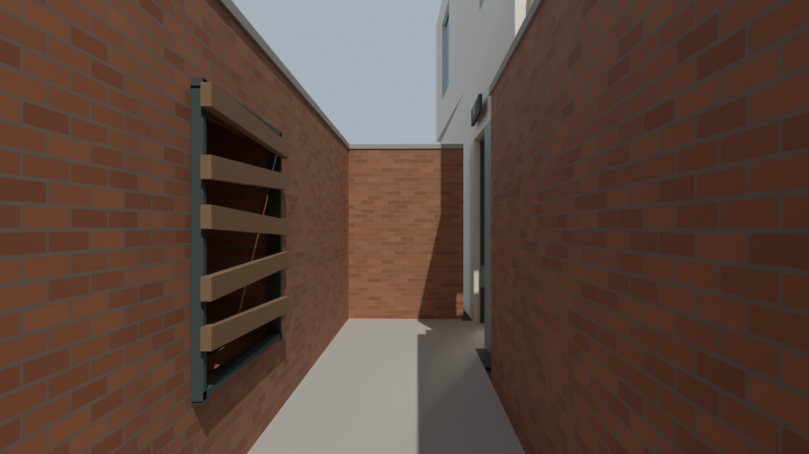
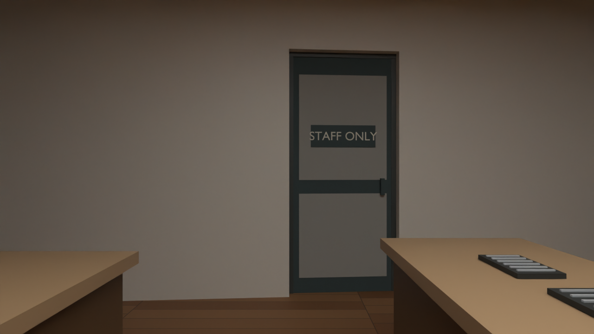

# Rear alley and Zombies mapping — v30

[Before/after gallery and highlight video](../recon/v30/index.html) ·
[Editable Blender source](../assets/blender/pharmacie-zombies-alley-v30.blend).
Built from the complete v29 scene; pub/shopfronts/Taraj/bridge remain retained.

The pub's open rear slabs are replaced by a continuous roughly **2m-wide alley**
between two brick boundaries, turning tightly behind the pub to the existing
rear doorway. The neighbouring rear area is a closed service-building mass,
with a roof and ground backing around the route. The wide empty landing is
archived. A copied rear-door leaf is parked against the wall to avoid a pinch;
the original is archived unchanged. Front door → street → alley → rear door →
pub remains the intended escape loop.

Practical bulkhead lamps, surface conduit, an electrical cabinet, shallow bins,
drain grilles and coping stones give the passage a service-alley character.
Props hug the wall; the nominal 2.02m width narrows to about 1.6m by the bins.
The outdoor sky above the alley is intentional.

A framed, boarded rear window has an enclosed pocket behind it: floor, back,
sides and ceiling. It provides a future Zombies entry location without looking
into the background. It is static Blender geometry; repair/spawn behavior still
requires the stock BO3 systems. Proposed barricade, rear-door and possible
wall-buy anchors sit in a separate planning collection.

The exposed bar-side opening now has an opaque panelled **Staff Only** door,
handle and sign. It is closed scenery rather than an unfinished accessible room.

## What changed and what was checked

- 87 new closed solids; old floor slabs and rear leaf archived, source preserved.
- Saved-file route probes: 572 samples, 0.42m radius, supported floor, no recorded
  radial blockers or low overhead hits. This is wider than the earlier 0.35m check.
- Twenty side/rear enclosure rays hit geometry; the bar-side gap now hits the new
  opaque door. Barricade pocket floor/ceiling/backing rays pass.
- All 44 catalogued original reference hashes match. The v29 checkpoint hash and
  existing mesh geometry are checked against the saved v30, including archives.
- Matched 1280×720 Cycles stills use 16 samples and temporary daylight/room fill.
  Gold/green highlight materials are temporary and not saved into the source.

[Changes manifest](../recon/v30/changes.json) ·
[Saved-file validation](../recon/v30/validation.json).

Rear walls, neighbouring infill, props and the barricade pocket are gameplay
adaptations at the existing enlarged pub scale, not a surveyed claim about
Syston's rear architecture. This pass fixes the pub's rear mapping and the
bar-side visual opening. The junction terrain, long-road playable bounds,
upstairs balance and other unfinished street interiors remain separate work.

## Engine work remains

New geometry is Blender-only. No Radiant export/compiler/game/deployment occurred.
The old engine playtest is unchanged. Convert walls/floors with suitable simple
collision; reconnect the retained front/rear linked purchase; register the
barricade and spawn pocket in the correct zone; then test zombie pursuit,
door-use volumes, two-way traversal and co-op. The 1.6m bin section should be
checked for player passing/revives under pressure. Sparse rays are not a full
capsule sweep, watertightness certificate or BO3 navigation test.

## Reproduction and review video

Run Blender 5.2 `--background <input.blend> --python <script>`:

1. V29 → `scripts/build_rear_alley_v30.py` saves new v30. Current generator
   already includes the frontage wall correction.
2. For the initial generated checkpoint only, `finish_rear_alley_v30.py` fixed
   the initially short east wall. Do not reapply to the corrected generator output.
3. `park_rear_door_v30.py` archives/copies and parks the leaf, applied once.
4. `check_rear_alley_v30.py` verifies the saved checkpoint and original preservation.
5. `render_rear_alley_v30.py` renders matched after/highlight and v29 before views.
6. `python scripts/gallery_rear_alley_v30.py` makes the local gallery and video.

Local build/check/render logs: ignored `build/rear-alley-v30-*.log`. No files in
the game/tools install are changed. Earlier checkpoints and user work are retained.

Video: labelled textured before/after and gold/green highlights, 1280×720, 24fps,
20 seconds, gentle animated zooms from still renders. It is a comparison edit,
not a continuous traversal. Encoding/size: [video manifest](../recon/v30/video.json).
