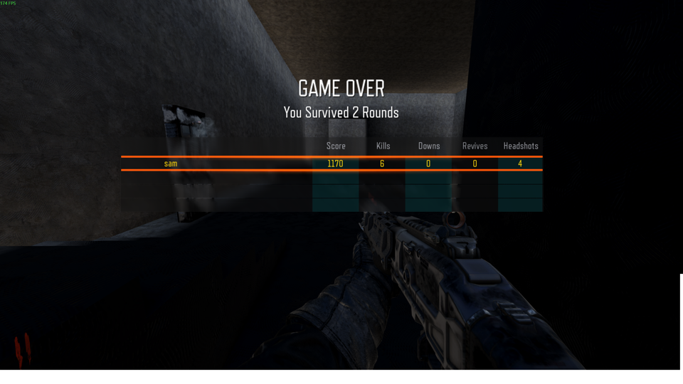

# SVG blockout

The user-authored `references/pharmacie-syston/pharmacie-layout.svg` is the layout source. Its companion JPEG and JSON are preserved unchanged.

Run `python scripts/generate_blockout.py` to regenerate the map. `scripts/svg_blockout.py` reads rendered rectangle bounds and quarter-turn transforms. Screen-to-world conversion is `x=(svg_x-466)*2`, `y=(550-svg_y)*2`. The planner's size metadata is inconsistent between original and added objects, so it is deliberately not used.

Implemented: relocated bar, hollow toilet with doorway, rear-left outdoor smoking patio, rear stairs and connecting east flight, raised front-right platform, tables, sofa and feature-prop placeholders. Original template Zombies scripts, perks, weapon purchase and mystery box remain.

Gameplay interpretations, not measured architectural facts:

- Sam clarified that the stairs form an L and lead to one large empty upstairs room. The east flight now rises north to a 168-unit landing, then the rear flight rises west to the 336-unit upper floor. Individual rises are approximately 12.92 units. The upper room follows the main pub footprint (704×1440 usable units) and has a 304-unit clear height; these are blockout dimensions, not surveyed measurements. Its floor leaves an L-shaped opening over the stairs.
- The off-canvas `stauir` marker is ignored.
- Sam's later request puts the entrance at the door in the clear frontage photograph; this supersedes the SVG entrance position. A bounded outdoor forecourt replaces the narrow vestibule, allowing the photo front to be viewed.
- Patio threshold bridges the small drawn gap. Patio walls bound playable space.
- Toilet door faces the bar; source has no door marked.
- Furniture uses simple tops, legs and seats; eight tables with two chairs each. Bar, wall, frontage and transparent skeleton photo meshes are implemented; bespoke 3D props remain deferred. See PHOTO_MATERIAL_WORKFLOW.md.
- Stock wood differentiates floors, furniture, bar and stairs; patio walls use stock brick. These are temporary materials observed in the installed stock map sources. Upstairs is empty apart from lighting and its stair opening.
- Initial player markers are moved into the central aisle. Zombie spawner classname is corrected and risers redistributed inside reachable floor space.

Compilation is necessary but does not establish runtime playability. See MODLOG.md for actual build and game results.

## First runtime result

BO3 loaded this SVG build on 2026-10-02. The user's local play session reached the results screen with 2 rounds survived and 6 kills. This establishes solo loading, zombie combat and round progression; full route coverage and co-op remain unverified.

