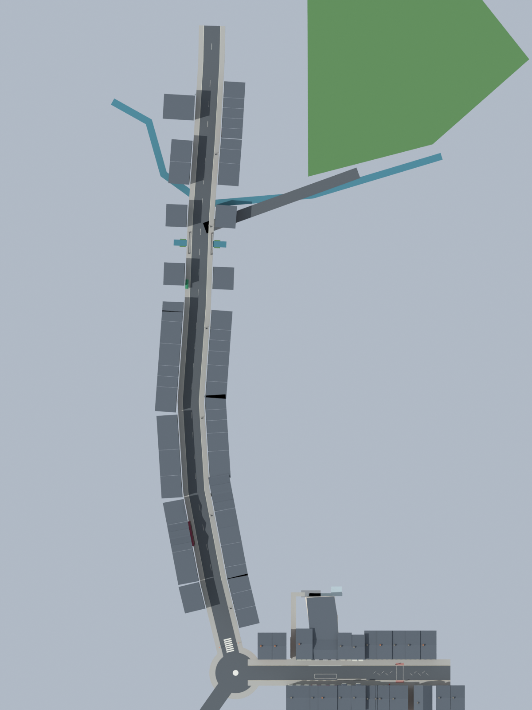
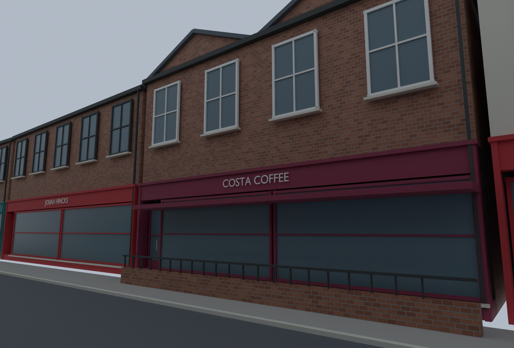
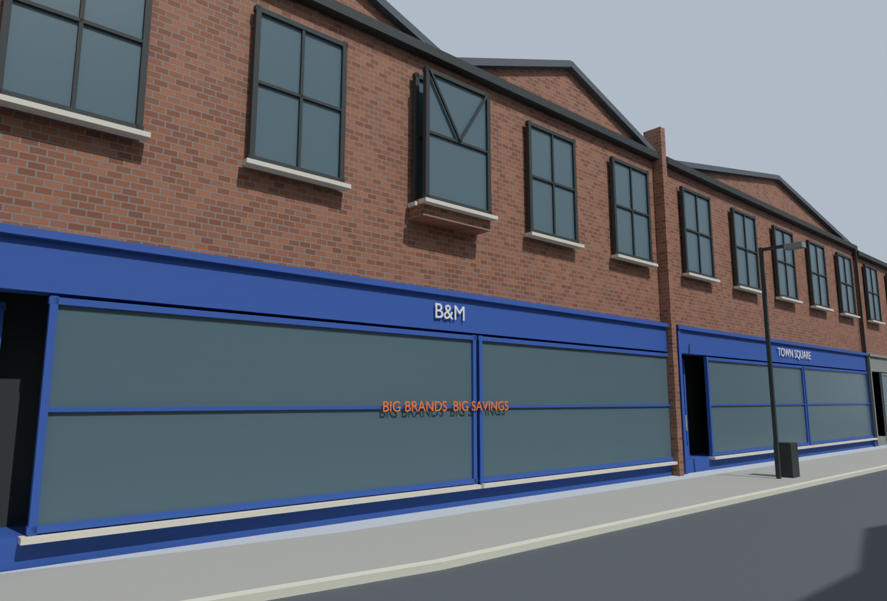
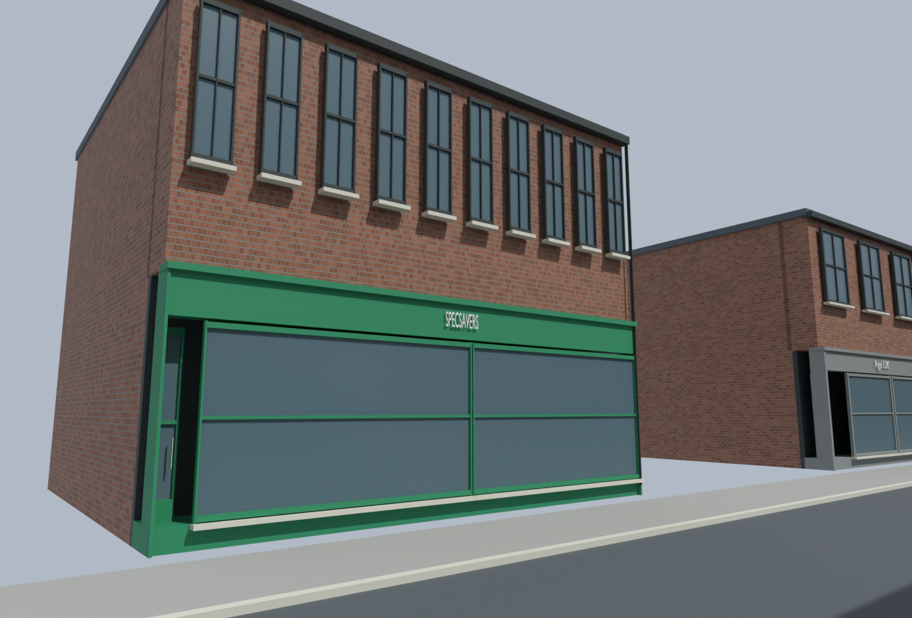
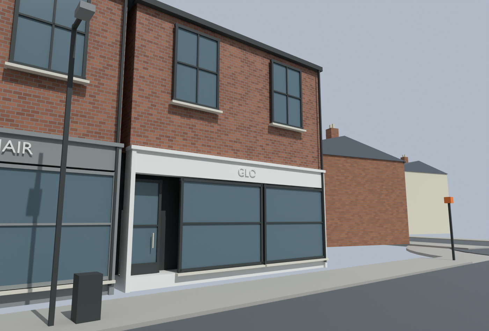
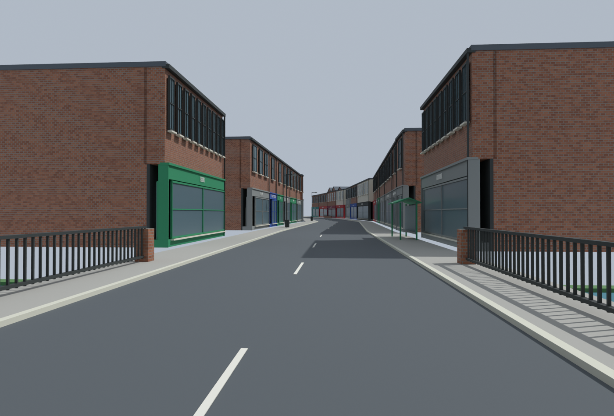
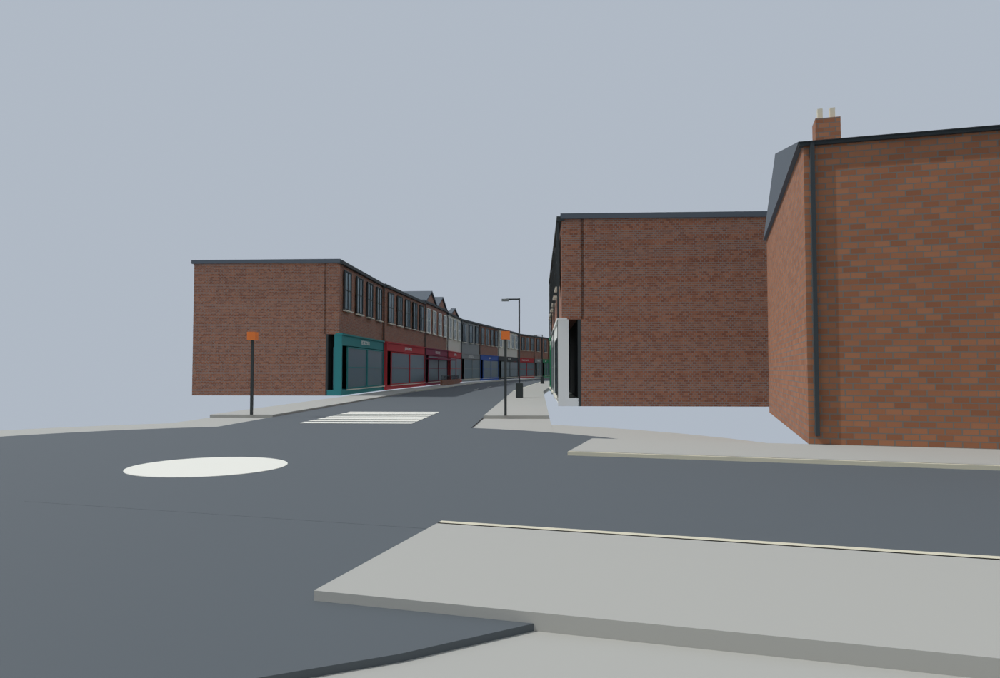

# Syston street base — Blender v25

[Open the editable checkpoint](../assets/blender/pharmacie-syston-street-v25.blend)
or run `scripts/open-blender.ps1`. This extends the retained pub/neighbours,
opposite High Street shops, fridge adjustment and corrected Taraj placement.

The [numbered catalogue](street-catalogue/index.html) supplies the references.
46 Melton frontages now have named fascias, geometric lettering, recessed closed
doors, display frames, sills, upper windows, gutters and downpipes. B&M/Town Square
and Costa have modelled gables; B&M has its projecting bay/Y frame, Costa its
burgundy canopy and patio rail. The bus shelter, bridge railings, lamps/bins,
zebra and painted mini-roundabout provide street context.

This is the photo-led **base pass**, with approximate parcel widths and depths.
It retains the existing gameplay scale rather than treating catalogue markers as
surveyed footprints. Shop occupancy varies across the dated references. Glazing
is opaque scenery; fine displays and interiors remain future work.

## Review renders

Subsequent [bridge close-up review](BRIDGE_REVIEW_V25.md) identifies remaining
brook/landscape detail and a side-access overlap. These base views below are
not evidence that the bridge area is finished.

Temporary daylight makes the geometry readable; these are Blender renders.

## Reproduce and resume

`scripts/model_syston_v25.py` creates the new scene from saved v24 and the small
catalogue JSONs; `scripts/review_syston_v25.py` applies render-discovered corrections.
The latter runs once on the first generated checkpoint;
`scripts/finish_syston_v25.py` then restores the full bridge-side gap after the
native render review. Validation and frontage
placement estimates are in [recon/v25/validation.json](../recon/v25/validation.json).
Generic scenery is archived in an unlinked collection, never deleted.
Current live v23 edits were copied to ignored `build/before-v25-live-editor.blend`.

No v25 geometry has been exported, compiled or tested in Radiant/BO3. Before that
step, choose gameplay boundaries/zones, then review frontage detail, collision,
texture export and zombie routes. Historical notes below other gallery pages
still refer to earlier checkpoints.
