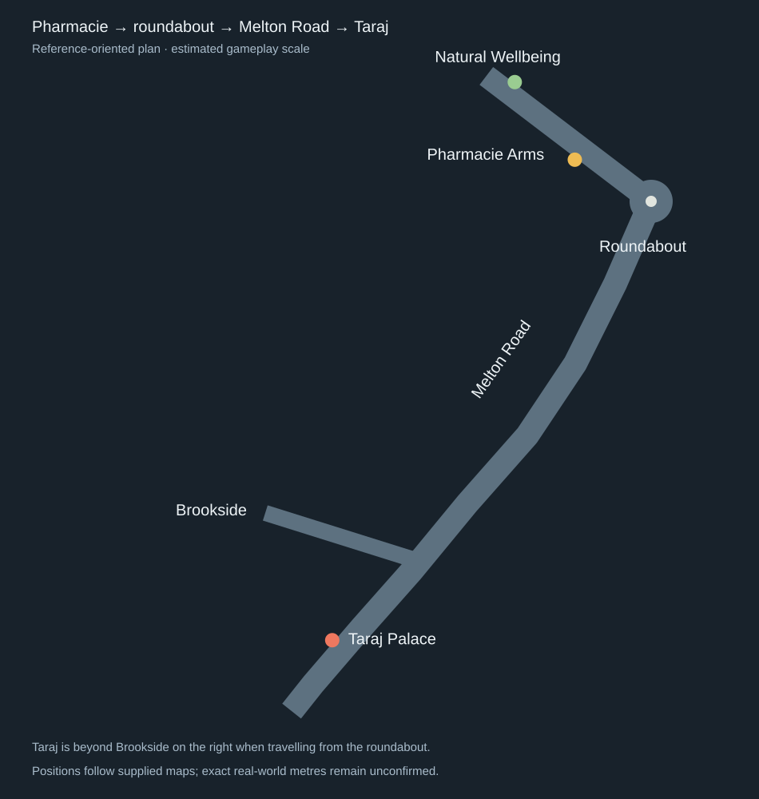
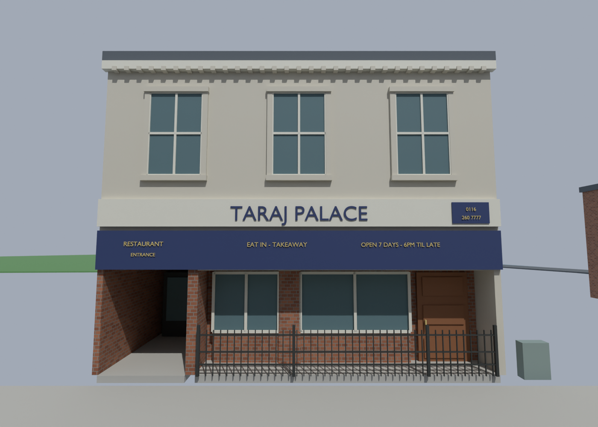
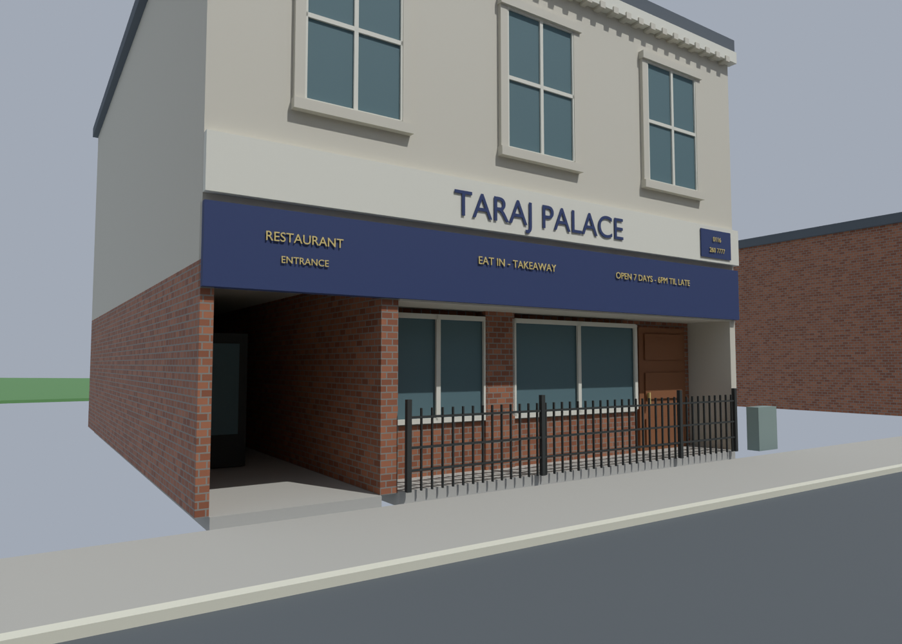
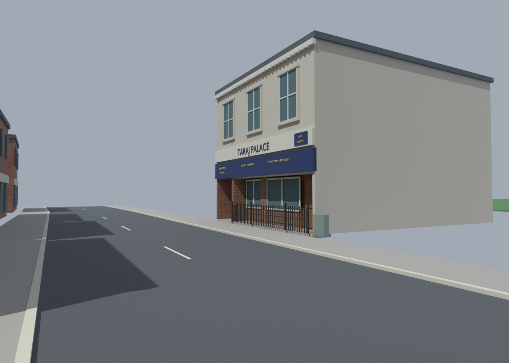

# Taraj Palace frontage — v23

[Latest complete Blender map](../assets/blender/pharmacie-taraj-front-v23.blend)
retains the [Melton Road route](MELTON_ROAD_V22.md), reviewed Pharmacie/shopfronts
and fridge. Taraj's initial mass has been replaced with a photo-led exterior.

## Position relative to the Pharmacie

The pub stays on High Street, with Natural Wellbeing farther along the opposite
row. From the pub, follow High Street to the roundabout, then Melton Road beyond
Brookside: Taraj is on the east/right side of that route, facing the road.
The labelled source and the later unmasked map agree on this relationship.
Its Blender frontage centre is `(-46.14, 270.88)`, while the pub-front review
anchor is `(4, 0)` and the roundabout is `(-40, -6.7)`. Exact real-world metre
distances are unconfirmed; the existing enlarged gameplay scale is retained.
This is a coherent street position rather than a nearby isolated frontage.
[Placement manifest](../recon/v23/placement.json) records the anchors.

## Observed reference details

The supplied daytime angled image identifies 1183 Melton Road and displays an
Aug 2024 Street View capture date. Taraj has cream render, three upper sash
windows with pale surrounds, a dentilled cornice, a pale projecting main sign
and a blue lower fascia. The main wording is **TARAJ PALACE**; smaller lettering
identifies restaurant entrance, eat-in/takeaway and **Open 7 days - 6PM til late**.
The visible telephone plaque reads **0116 260 7777**.

The night reference clearly shows the frontage split: a deep brick-lined
entrance passage on the left; a recessed window/door area behind a low black
iron fence on the right. That right bay has two glazed regions separated by a
brick pier and a brown door at its right edge. A utility cabinet is outside
the right corner. Nighttime sign lettering glows bright blue; the present
model uses daytime lettering, with neon lighting still to add if desired.

`right side of taraj.png` actually shows Costcutter Carpets & Beds, a neighbouring
frontage, rather than Taraj's side wall. Preserve the filename and interpret its
contents. The unmasked map explicitly pins Taraj Palace below Brookside on
Melton Road's east side; it also places Costa on the opposite side from the
initial rough label guess. Detailed surrounding identities remain placeholders.

## Implemented and estimated

The exterior has actual recessed geometry, separately modelled signs/lettering,
three pub-sized upper window assemblies, window frames/brick piers, a left
passage/closed entrance, brown right door, cornice detail and iron fence bars.
The old red provisional front is archived unlinked. No reference image has
been cropped, changed or applied as a full flat facade.

Frontage width 12 m, depth 15 m and eaves 9.5 m remain gameplay estimates.
Upper glazing is 1.68016 m wide and 2.61 m high at Z5.865–8.475, matching the
pub scale requested earlier. Typeface, roof form, door panels and depths are
approximate. The roof is a simple flat scenery cap pending stronger roof evidence.
The passage's internal doorway position is estimated. No restaurant interior,
working purchase doors or person/booth model has been implemented in this pass.
The newly supplied interior references are preserved for the later interior pass.

## Reviewed renders

Generation checks preserved 2,729 existing meshes and validated 151 new closed
outward solids. Screenshot review corrected the initial mirrored left/right
layout, upper glass behind the backing and a camera inside an opposite building.
[Saved-source checks](../recon/v23/source-checks.json) test visible upper glazing,
the left passage's recessed door and all new route/frontage solids.
Source hashes are in [the manifest](../recon/v23/validation.json).
Temporary daylight is not saved; no Radiant build or in-game verification occurred.

Reproduce from saved v22 with `scripts/model_taraj_v23.py`. Historical first-pass
corrections are recorded in `scripts/review_taraj_v23.py`; do not repeat its
reflection on the already corrected source. Pipeline idea for automated frontage
references: [research folder](../research/streetview-pipeline/README.md).

Sam subsequently requested the opposite roadside. See [v24 placement](TARAJ_V24.md); the v23 roadside description above is historical.
