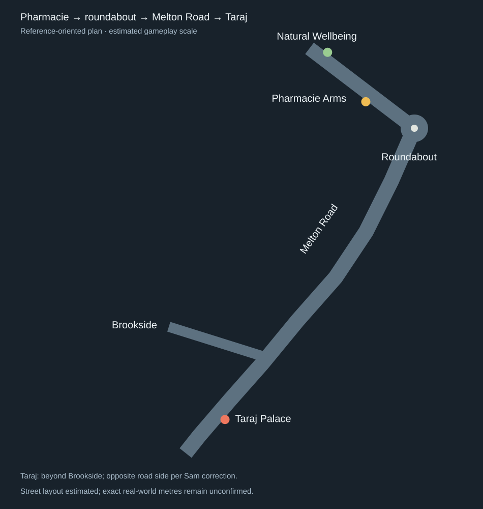
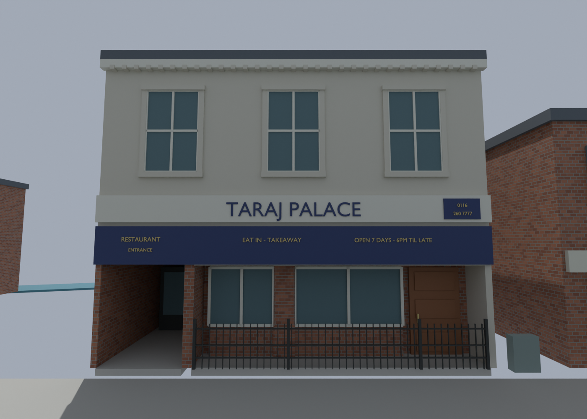
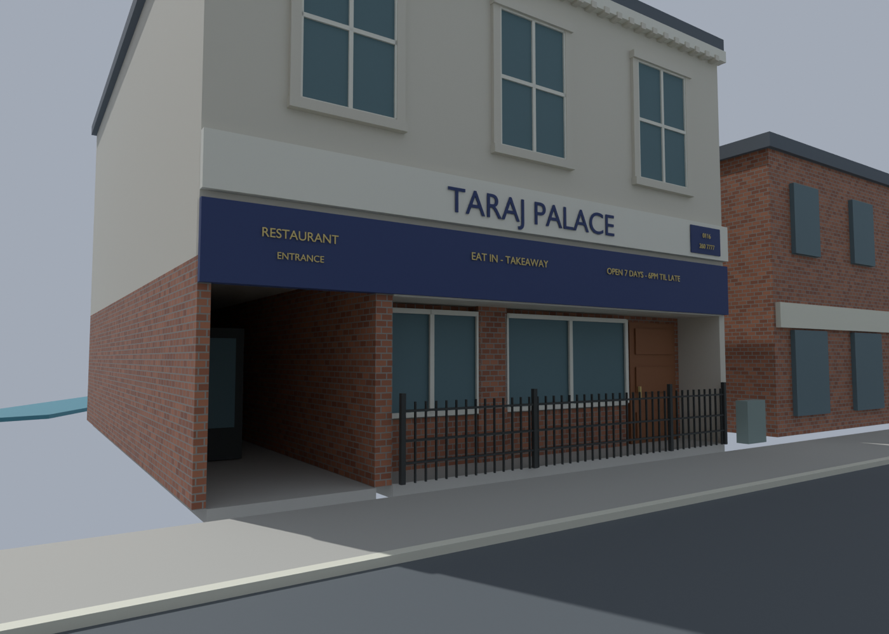
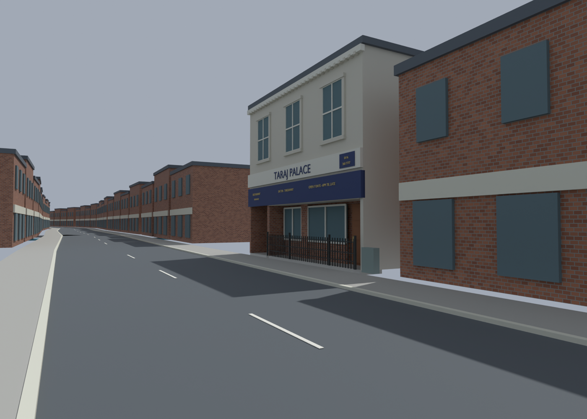
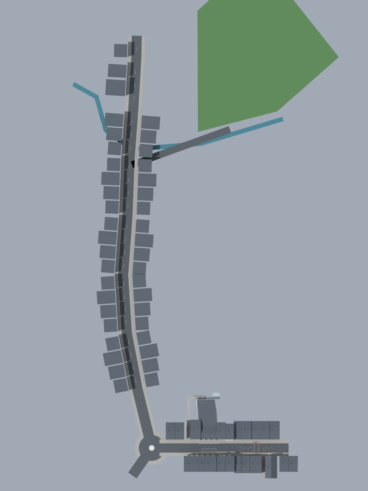

# Taraj Palace — corrected roadside placement

[Latest Blender map](../assets/blender/pharmacie-taraj-opposite-v24.blend).
Sam reviewed the first Taraj pass and requested moving it to the **opposite
side of Melton Road**, with everything else retained. That instruction supersedes
the first inferred roadside interpretation in [v23 notes](TARAJ_V23.md).

The complete exterior rotates 180° about its road-centre projection. It stays
at the same point along Melton Road beyond Brookside, keeps its size and details,
and faces the carriageway. Placeholder buildings occupying its new parcel are
archived unlinked. The pub, roundabout, road route and other shopfronts are retained.

The [placement/check manifest](../recon/v24/validation.json) records the old/new
frontage coordinates, road pivot, retained meshes and cleared placeholders.
All 151 Taraj solid meshes move as one rigid assembly, preserving scale and
left/right frontage details. Review cameras move with it. No original images
are changed. Road dimensions/distances remain estimates at the enlarged pub scale.
This is Blender work only; no Radiant/game changes or verification are claimed.

Reproduce from saved v23 using `scripts/relocate_taraj_v24.py`. Updated placement
diagram comes from `scripts/document_taraj_placement.py`.
The [Street View pipeline idea](../research/streetview-pipeline/README.md) is
recorded separately for a future prototype.
