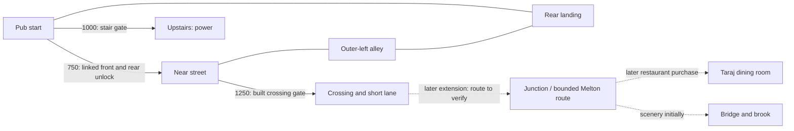

# Zombies map design alongside streetscape work

Planning pass, 4 October 2026. Sam requested a second agent to work out the
Zombies map alongside Blender mapping. This document proposes gameplay using
the retained layout; it does not authorize or implement an engine conversion.
Preserve approved building placement and the pub/Taraj interiors.

## Current evidence and scope

| Area / system | Actual state | What remains |
|---|---|---|
| V18 pub starting area and stock rounds | Separate `zm_pharmacie_playtest` loaded; solo combat/rounds observed | Full survival, collision and co-op checks |
| Street/front-rear linked purchase, 750 points | Authored and deployed; Sam confirms doors work | Both exits, zone activation and pursuit in both directions |
| Upstairs purchase, 1,000 points | Authored/deployed; Sam confirms stair doors work | Stair chase, retreat, upper spawns and co-op |
| Quick Revive, upstairs power, four wall buys | Authored in v18 | Each interaction and its supported placement |
| Intended outside mystery box | Authored static base/location only: installed prefab lacks functional box entities | Complete stock box assembly/use-marker/zbarrier, then runtime test |
| Crossing purchase, 1,250 points; fourth zone / three additional risers | Compiler/navmesh/light/link passed | Last handover says built but not deployed; purchase, collision and AI unverified |
| V19–v29 shops, Taraj interior, bridge/brook and street detail | Blender scenery/modelling; inspected renders and geometry checks | Engine conversion, collision, zones, AI and performance |
| Latest v30 Blender checkpoint | Documented/reviewed enclosed rear alley, parked rear leaf, closed service door and future entry pocket; saved-file probes and before/after gallery | Remeasure legacy v18 gameplay anchors before conversion; no engine rebuild/runtime proof |

Sources: [v18 gameplay](PLAYTEST_V18.md), [handover](HANDOVER_2026-10-03.md),
[current street detail](SYSTON_DETAIL_V29.md), [Taraj/bridge](TARAJ_BRIDGE_V26.md),
[geometry review](ZOMBIES_GEOMETRY_REVIEW_V28.md), and
[current v30 rear-alley notes](REAR_ALLEY_V30.md). Latest modelling baseline is
`assets/blender/pharmacie-zombies-alley-v30.blend`; this document's V29 filename
is retained for existing links. The deployment state above is
the last documented state, not a fresh process/package inspection.

Recommendation: first finish a small, dependable cooperative survival map around
the pub, its outside/rear loop and upstairs. Use the crossing as the first tested
extension. Add Taraj only after that core plays well. Detail the wider street as
Sam requested, while keeping its scenery separate from combat-zone decisions.

## Proposed route and purchases

Solid edges describe the v18 authored route/design; they do not certify runtime
navigation. Dotted edges are future proposals, not established playable links.
Graph nodes are functional areas, not exact engine-zone boundaries.

- Keep the front/rear exits linked: one street purchase should create a readable
  escape circuit rather than another unexpected locked door at the rear.
- Preserve the outer-left alley beyond the left neighbouring building. Do not
  move it beside the pub to shorten the loop. The rear/stair route goes around
  the left of the bar; the right-hand service room is not a shortcut.
- Keep upstairs an optional early investment in power, compared with outside's
  immediate space and box. Do not add compulsory objectives on stair treads.
- Give the crossing a visible reward before purchase: a supported perk/weapon
  position near its open street portion. Its existing short lane is a dead end;
  leave it scenery initially or make its dead-end status obvious and its retreat
  unobstructed. It is not a second loop.
- Start a future Taraj purchase at its actual front arrival, after a bounded,
  validated route from the junction. Do not invent a backdoor or kitchen escape
  as venue fact. Two interior aisles do not provide two independent exits.
- Keep bridge deck, railings and brook as visible context initially. A bridge
  combat extension would need a deliberate reward and proven ground/collision
  continuity; do not open the water/banks just because they are modelled.

The existing 750/1,000/1,250 prices are the baseline, not newly balanced values.
Leave later gate prices unset until early-round earnings and travel time are
observed. Avoid charging separately for every shop.

## Rewards and identity: proposals

| Place | Suggested role | Placement rule |
|---|---|---|
| Pub | Existing Quick Revive and RK5; KRM at rear approach | Keep main aisle, first combat and rear retreat clear |
| Near street | Intended box site and existing Kuda; proposed Juggernog after power | Functional box assembly unresolved; supported pavement bay with room for a buyer and teammate passing |
| Upstairs | Existing power and KN-44; proposed Speed Cola | Reward the choke, but keep arrivals/retreat clear; avoid stacking all essential perks here |
| Crossing | Proposed Double Tap or a stronger wall-buy branch | Reward visible from approach; outside the short dead-end lane |
| Taraj, later | Recommended Pack-a-Punch destination after power | Use a reviewed arrival/bar-adjacent position that preserves both aisles; machine footprint still unknown |
| Bridge, later | Possible optional objective/view landmark | Decide only after Taraj/core balance; no required brook traversal |

These new perk/Pack-a-Punch placements are design choices, not claims that the
stock assets or scripts have been checked/placed. Build a functional box at the
existing reserved site for the first balance test; moving locations can follow once routing
is dependable. Stock v18 weapon identities/prices are recorded in PLAYTEST_V18.

The pub's pharmacy displays and skeleton chair should establish the atmosphere;
Taraj supplies a contrasting restaurant reward destination. Start with classic
survival and readable purchases. An optional pharmacy-themed quest can follow.
Noseley remains a later milestone using a stock placeholder first; the tight
stairs and Taraj entry are poor first boss arenas. No custom boss work belongs
ahead of reliable rounds, navigation and co-op.

## Mapping constraints to carry alongside visual detail

1. Maintain the pub centre aisle, left bar approach, stair landings and linked
   rear route. Use simple intentional collision on seating/props rather than
   exporting every chair leg, glass and decorative projection as a player snag.
2. The v28 review found an exposed bar-side doorway and incomplete junction/rear
   surroundings. Reviewed v30 closes the service doorway and encloses the alley,
   with the rear leaf parked clear of the turn. Preserve those fixes; the
   junction still needs an independent continuous-ground/boundary review.
3. The v30 manifest reports an alley clear width of 2.02m and 1.595m beside bins;
   these are generated scene measurements, not surveyed venue widths or proven
   co-op clearances. Test opposing players, revives and pursuing zombies there.
4. Keep shops without complete interiors as scenery. A detailed display window
   does not imply a buyable combat room. Keep unfinished spaces behind clear
   closed boundaries rather than opening rewards into empty world.
5. Street combat needs several local approaches rather than one distant horde.
   Reserve supported perimeter entries near each activated area, outside the
   central escape/revive lane. Gate upper/crossing/Taraj entries to their unlocks.
   Far scenery should not keep spawning unreachable final zombies.
6. The v30 rear barricade pocket is a proposed local entry, not a functioning
   repairable window. Verify a stock barrier route into the rear turn before
   relying on it; avoid a spawn directly on the landing where players revive.
7. Update door removal, zone state and AI connections together. Interaction
   volumes must sit in accessible space outside solid blockers; test use from
   every intended side rather than only the trigger centre.
8. Treat kerbs/refuges/rails/road markings as both visual and circulation work.
   Reference reconstruction may change the crossing shape; recheck route and
   item alignment after it, without moving approved buildings for convenience.

## Stages and manual acceptance tests

Modelling handoff: reserve the existing main pub aisle, left bar/rear passage,
front/rear thresholds, both stair landings, outer-left alley/rear turn, Taraj
arrival and two longitudinal aisles. Keep purchase/item approach space on
supported flat floor; mark future spawn pockets separately from player escape
routes. Define visible street ends and inaccessible shop/service openings as
intentional boundaries. Discuss any proposed second upstairs/Taraj exit, moved
doorway, changed stair width or moved building with Sam before changing the
approved geometry: those would be new gameplay adaptations, not reference fixes.

No engine changes or game input are part of this planning pass. When conversion
resumes under the agreed workflow, Sam retains controls; agents can inspect
passive screenshots/logs and record results.

| Priority | Sam's manual test | Accept when |
|---|---|---|
| P0 | New match, solo, then intended four-player private session | Every player spawns on supported floor; rounds start/end; no overlap or immediate trap |
| P0 | Buy upstairs first in one run; outside first in another | Correct price/removal, correct newly active areas, no zombie pursuit through locked gates |
| P0 | Buy outside; walk full front → alley → rear → pub loop, then reverse, with pursuit | Both exits open; player/zombies traverse thresholds/turns; no persistent unreachable zombies |
| P0 | Ascend/descend stairs under pursuit; pass teammates and revive at landings | No stair/turn snag or unavoidable body block; upstairs zombies can return to pub |
| P0 | Sweep floors, boundaries, service door, platform and furniture | No fall-out or unintended escape; player and zombie collision agree; no new snag points |
| P1 | Use each wall buy, box, Quick Revive and upstairs power | Correct interaction/price/state; weapons and power usable; no interaction requires furniture climbing |
| P1 | Open crossing after package deployment; enter/leave lane with pursuing zombies | Price/removal correct; all new spawns reach players; lane retreat and outer boundaries work |
| P1 | Split teammates between pub/street/upstairs; down and revive one in each | Zones remain consistent for whole team; zombies pursue valid goals; revived player can escape |
| P1 | Play several early/mid rounds and record purchases, wait times, downs and stuck zombies | Both opening choices are viable; round ends reliably; outside has pressure without excessive travel |
| P2 | Later Taraj slice, then optional bridge slice | Supported entry, buy/removal, local spawn pursuit and return journey pass before widening combat |

Record build identity, player count, unlocked areas, route/direction, screenshot
or log evidence and pass/fail for each test. A compiled navmesh, Blender ray hit,
camera flythrough or working purchase alone does not establish AI or co-op.

Implementation order: (1) use reviewed v30, remeasure legacy anchors and finish remaining ground/boundaries;
(2) validate the existing small engine core and pending crossing package;
(3) tune perks/prices/local spawns from those runs; (4) convert one bounded
Taraj route/reward slice; (5) consider quests, bridge combat and Noseley.

## Sam's preferences to settle later

Detailed conversion handoff: [Radiant gameplay placement plan](RADIANT_GAMEPLAY_PLACEMENT_PLAN.md)
and [stable-ID coordinate/state registry](radiant-gameplay-plan.json). These
expand the gate/item/spawn specification while preserving the proposals above.

Working default: classic survival, compact opening with optional branches,
upstairs power, Taraj as a later Pack-a-Punch destination, bridge initially scenery.
These defaults let planning continue without interrupting streetscape modelling.
Sam can steer whether Taraj should be an essential destination or optional room,
whether the eventual bridge is playable, and how much quest/boss content he wants.
No gate, reward or new connection should be represented as already approved or
implemented merely because it appears here.
